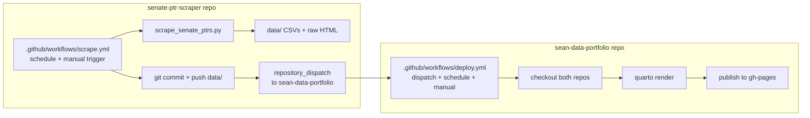

# Automate Senate PTR scraping + add a Senate page to the site

## Goal

1. Convert the manual Colab-based Senate PTR scraper into a fully automated
   pipeline that runs on GitHub Actions on a schedule (no more manual Colab
   runs).
2. Add a new "Senate" project page to `sean-data-portfolio`, mirroring the
   existing House PTR page, with a toggle to switch between House and
   Senate.
3. Automate the site build/deploy so it picks up fresh Senate data and
   publishes itself, instead of the current manual `quarto publish
   gh-pages` step.

## Key decisions confirmed with user

- **Scraping automation:** fully automated via GitHub Actions (no more
  manual Colab runs going forward). The Colab notebook stays as-is for
  manual/exploratory use, but a new plain Python script does the automated
  work.
- **Site deploy automation:** fully automated via GitHub Actions (replacing
  the manual `quarto publish gh-pages` workflow).
- **Data storage:** git-based, not Google Drive. The `senate-ptr-scraper`
  repo is the source of truth for scraped data; `sean-data-portfolio`'s
  build reads from it directly (no Google Drive API / service account
  needed).
- **Raw HTML:** the user wants to keep archiving raw per-filing HTML (not
  just the parsed CSV), and confirmed git (not Google Drive) for this too,
  after discussing the tradeoff. Rationale: routing raw HTML to Drive
  instead would require the *automated* GitHub Action to authenticate to
  the Drive API (service account + secret) — the same complexity avoided
  for the parsed CSV — so it wouldn't actually be simpler for the
  automated path. Estimated scale: ~100 senators with a handful of PTRs/
  year → roughly 1,000–3,000 electronic filings since 2021, growing by a
  few hundred/year; at ~50–150 KB per HTML page, a full backfill likely
  lands in the tens-of-MB to low-hundreds-of-MB range, comfortably under
  GitHub's ~1GB soft-warning threshold for the foreseeable future. Fallback
  options if it ever becomes a problem: Git LFS, or dropping HTML
  archiving from the automated path (the Colab notebook + Drive remain
  available separately for a manual personal archive, since that code path
  already mounts Drive).
- **Senate page structure:** a new, separate page
  (`projects/stock-disclosures-senate.qmd`) mirroring the House page's
  design, with a House ⇄ Senate toggle/switcher added to both pages (not a
  single page with in-page tabs).

## Architecture

Both repos already exist locally as sibling folders:
`C:\Users\Sean\Documents\GitHub\senate-ptr-scraper` and
`C:\Users\Sean\Documents\GitHub\sean-data-portfolio`. The website's Quarto
code will read Senate data from a relative sibling path
(`../senate-ptr-scraper/data/...`), and in CI we'll check out
`senate-ptr-scraper` into that same relative location so the exact same
relative path works both locally and in the GitHub Actions build.

## Important blocking issue discovered

`projects/stock-disclosures.qmd` currently reads the **House** data
directly from a local path: `G:/My Drive/Congressional Trading
Data/House_PTRs/07 Public Website Data/house_ptr_transactions_web.csv`.
This path does not exist on a GitHub Actions runner, so **the full site
cannot render in CI today** — it would fail on the House page before ever
reaching the new Senate page.

Fix (in scope for this plan, minimal version): copy the current House CSV
snapshot into the `sean-data-portfolio` repo (e.g.
`data/house_ptr_transactions_web.csv`) and update the R code to read from
that relative path instead. This is a one-time/manual-refresh copy for
now — full House automation (mirroring what we're building for Senate) is
explicitly **out of scope** for this plan, but the door is left open for a
future pass.

## Plan of work

### Phase 1 — Convert the notebook into an automation-friendly script
(`senate-ptr-scraper` repo)

- Add `scripts/scrape_senate_ptrs.py`, porting the logic from Cells 2 and
  5–10 of the notebook (session setup, filing-index search with the
  existing `MAX_SEARCH_PAGES` cap, electronic PTR parsing, transaction
  scraping/resume logic, status table).
- Replace the Drive-mount cell with plain local paths relative to the repo
  (`data/01_html/`, `data/02_filing_index/`, `data/03_transactions/`,
  `data/04_status/`), created via `Path.mkdir(parents=True, exist_ok=True)`.
- Config values (date range, batch size, request delay, `MAX_SEARCH_PAGES`)
  become script constants or env vars with sensible defaults, so the
  workflow can override them if needed (e.g. a shorter lookback window for
  routine runs vs. a full backfill).
- Add `requirements.txt` (`beautifulsoup4`, `lxml`, `openpyxl`, `pandas`,
  `requests`).
- Leave the existing notebook untouched for manual/Colab use; note in the
  README that the script is now the automated path and the notebook is for
  manual/exploratory runs.

### Phase 2 — Scraper GitHub Action
(`senate-ptr-scraper` repo)

- `.github/workflows/scrape.yml`:
  - Triggers: `schedule` (daily, default `06:00 UTC` — adjustable) and
    `workflow_dispatch` (manual runs).
  - Steps: checkout, set up Python, `pip install -r requirements.txt`, run
    `scripts/scrape_senate_ptrs.py`.
  - Commit step: if `git status` shows changes under `data/`, commit and
    push them (using the default `GITHUB_TOKEN`, which requires this repo's
    Settings → Actions → General → Workflow permissions set to "Read and
    write").
  - Final step: fire a `repository_dispatch` event
    (`senate-data-updated`) to `sean-data-portfolio` so its deploy workflow
    runs immediately after new data lands. Requires a **fine-grained
    Personal Access Token** with `contents: write` (or at least
    `actions: write`/dispatch permission) on `sean-data-portfolio`, stored
    as a secret (e.g. `SITE_DISPATCH_TOKEN`) in this repo. **User action
    required** — I can't create GitHub PATs or repo secrets myself.

### Phase 3 — Senate page on the website
(`sean-data-portfolio` repo)

- Add `projects/stock-disclosures-senate.qmd`, reusing the House page's
  structure/CSS (title block hidden, wide-shell layout, featured-card,
  DT table, etc.) so the two pages feel like one product.
- Data is read from `../senate-ptr-scraper/data/03_transactions/<file>.csv`
  (exact filename to match whatever Phase 1's script writes).
- Add a small "House / Senate" toggle control (two linked buttons) near the
  top of both `stock-disclosures.qmd` and the new Senate page, so users can
  jump between chambers. Kept as a simple shared HTML/CSS snippet rather
  than a new nav dropdown, to match the existing page's self-contained
  style.

### Phase 4 — Fix the House data path for CI
(`sean-data-portfolio` repo)

- Copy the current House transactions CSV into
  `data/house_ptr_transactions_web.csv` in this repo.
- Update the R chunk's `data_path` to the relative path.
- Note in the README that this is a manual snapshot for now (refresh by
  re-copying from Drive) until/unless House scraping is automated the same
  way Senate is.

### Phase 5 — Site deploy GitHub Action
(`sean-data-portfolio` repo)

- `.github/workflows/deploy.yml`:
  - Triggers: `repository_dispatch` (type `senate-data-updated`),
    `schedule` (weekly fallback), `push` to `main`, and `workflow_dispatch`.
  - Checkout this repo, then checkout `senate-ptr-scraper` into the sibling
    path `../senate-ptr-scraper` (via `actions/checkout`'s `repository` +
    `path` inputs).
  - Set up R (for the existing `readr`/`dplyr`/`DT`/`jsonlite` chunks) and
    Python (if other project pages need it — to be confirmed while
    auditing all `projects/*.qmd` engines).
  - Install R/Python dependencies, run `quarto render`, then publish the
    rendered `_site/` to the `gh-pages` branch (via the
    `quarto-dev/quarto-actions` publish action).
- **User action required:** confirm GitHub Pages is configured to serve
  from the `gh-pages` branch (Settings → Pages), matching the existing
  manual `quarto publish gh-pages` setup.

### Phase 6 — Validation

- Trigger both workflows manually (`workflow_dispatch`) once set up, before
  relying on the schedules, to confirm: the scraper runs and commits data,
  the dispatch fires, and the site renders + deploys correctly with both
  House and Senate pages live.

## Manual steps only the user can do (not tool-accessible to me)

- Push `senate-ptr-scraper` to a GitHub remote (repo doesn't exist on
  GitHub yet — only pushed locally so far).
- Create a fine-grained PAT for cross-repo `repository_dispatch` and add it
  as a secret in `senate-ptr-scraper`.
- Set `senate-ptr-scraper`'s Actions workflow permissions to "Read and
  write" so the scrape workflow can push commits.
- Confirm/enable GitHub Pages on `sean-data-portfolio` serving from
  `gh-pages`.

## Sequencing decision: Senate first, House as a follow-on project

The user asked whether to automate House PTRs now alongside Senate, or do
Senate first. Investigated the House pipeline
(`G:\My Drive\Congressional Trading Data\House_PTRs\06 Workflow
Notebooks`) to inform this:

- **House has 4 stages, not 1:** (1) download PDFs from the Clerk's XML
  index, (2) archive indexes + verify PDF completeness, (3) extract
  transactions from born-digital PDFs via a hand-built PyMuPDF
  geometry/table parser (~4,900 lines — by far the most complex piece of
  either pipeline), (4) clean/resolve ticker symbols. A 5th notebook is
  just an orchestrator that runs 1–4 in sequence.
- **No GPU/OCR/ML dependencies** in the current House pipeline (good — it
  can run on standard GitHub Actions runners like Senate can), but
  scanned/image-only PDFs are explicitly deferred to an unimplemented
  future OCR/vision stage — out of scope for now, same as House's own
  notebooks already treat it.
- **Data scale:** PDF archive ~200–350MB across 2021–2026 (~3,000 files),
  parsed CSVs under 100MB combined — still git-friendly, but notably
  larger than Senate's HTML archive, and stage 3's complexity means
  porting it to an automation-friendly script is a bigger lift than
  Senate's single script.

**Decision: implement the Senate plan above first.** It's fully scoped,
much simpler to port (one script vs. four stages), and will validate the
whole automation pattern (scheduled scraping → git commit → cross-repo
`repository_dispatch` → automated Quarto deploy) end-to-end. Once that's
working reliably, House automation becomes a second, separate plan that
reuses the same pattern:

- A `house-ptr-scraper` repo (or a `house/` scope within the same repo —
  to be decided later) with 3–4 scripts mirroring stages 1/2/3/4, each with
  its own scheduled or chained GitHub Action (stage 3's PDF parsing may
  need its own resumable-checkpoint-aware workflow given it's the heaviest
  step).
- The same question Senate faced — commit raw PDFs to git, or not — will
  come up again for House, with a similar-in-kind but larger tradeoff
  (~250-400MB vs. Senate's tens-of-MB estimate). Not deciding this now;
  revisit when House is actually planned.
- A `stock-disclosures-house` page swap-in once House data is also
  automated (the House ⇄ Senate toggle built in Phase 3 above will make
  this a small addition later, not a redesign).

This plan file covers **Senate only**. House automation will get its own
plan once Senate is implemented and validated.

## Open items to confirm before/while implementing

- Exact scrape schedule cadence (defaulting to daily — say if you'd prefer
  weekly or another cadence).
- Whether the initial backfill (2021→today, potentially thousands of
  filings) should run once manually/locally first (to avoid a very long
  first Actions run against the Senate's rate limits) versus letting the
  first scheduled Action run do the full backfill.
