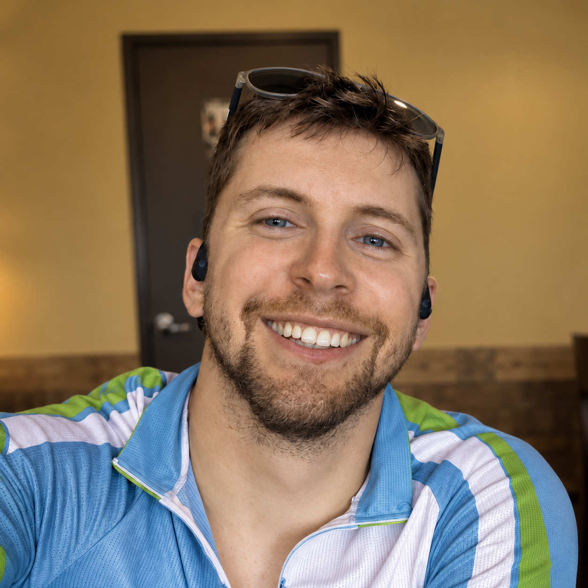

```{=html}
<style>
  :root {
    --ink:#26374d;
    --muted:#718095;
  }

  * { box-sizing:border-box; }

  body { overflow-x:hidden; }

  .page {
    position:relative;
    z-index:1;
    max-width:1100px;
    margin:0 auto;
    padding:6px 32px 690px;
    --about-h1-size:42px;
    --about-copy-size:23px;
    --about-copy-leading:1.55;
    --about-copy-gap:24px;
    --about-photo-size:260px;
    --about-h2-size:34px;
    --about-h2-top:38px;
    --about-h2-bottom:14px;
    --about-interest-size:21px;
    --about-interest-gap:22px;
  }

  /* Desktop playground is a single-screen scene. The page itself does not
     scroll; only the physics objects move. Mobile has its own compact
     single-screen layout below. */
  @media (min-width:761px) {
    html,
    body {
      height:100%;
      overflow:hidden;
    }

    .page {
      height:calc(100vh - 48px);
      min-height:0;
      padding-bottom:0;
      overflow:hidden;
    }

    #world {
      position:fixed;
    }
  }

  .page h1 { font-size:var(--about-h1-size); margin:0 0 16px; }

  .intro {
    display:grid;
    grid-template-columns:minmax(0,1fr) 260px;
    gap:48px;
    align-items:start;
  }

  .copy {
    font-size:var(--about-copy-size);
    line-height:var(--about-copy-leading);
    max-width:700px;
  }

  .copy p { margin:0 0 var(--about-copy-gap); }

  .photo-wrap {
  width:var(--about-photo-size);
  height:var(--about-photo-size);
  position:relative;
  touch-action:none;
  cursor:grab;
  border-radius:50%;
  overflow:hidden;
}

  .photo-wrap:active { cursor:grabbing; }
  body.page-locked .photo-wrap { cursor:grab; }

  .photo {
  width:100%;
  height:100%;
  object-fit:cover;
  border-radius:50%;
  display:block;
  user-select:none;
  -webkit-user-drag:none;
}

  .page h2 {
    margin:var(--about-h2-top) 0 var(--about-h2-bottom);
    padding-bottom:6px;
    border-bottom:0 !important;
    font-size:var(--about-h2-size);
  }

  .interests {
    display:grid;
    grid-template-columns:1fr 1fr;
    gap:var(--about-interest-gap) 80px;
    font-size:var(--about-interest-size);
  }

  .physics-word {
    display:inline-block;
    cursor:grab;
    touch-action:none;
    user-select:none;
  }

  body.page-locked .physics-word { cursor:default; }

  #world {
    position:fixed;
    inset:0;
    z-index:5;
    width:100%;
    height:100%;
    pointer-events:auto;
  }


  .telemetry-toggle {
    position:fixed;
    left:14px;
    bottom:12px;
    z-index:21;
    border:1px solid rgba(199,209,220,.9);
    border-radius:999px;
    padding:7px 12px;
    background:rgba(255,255,255,.94);
    box-shadow:0 5px 20px rgba(28,42,58,.07);
    backdrop-filter:blur(8px);
    color:#43566d;
    font:inherit;
    font-size:11px;
    font-weight:700;
    cursor:pointer;
  }

  .telemetry-toggle[aria-expanded="true"] {
    display:none;
  }

  .telemetry {
    position:fixed;
    left:14px;
    bottom:12px;
    z-index:22;
    display:none;
    width:286px;
    max-height:min(72vh,520px);
    overflow:auto;
    padding:9px 10px 10px;
    border:1px solid rgba(199,209,220,.82);
    border-radius:12px;
    background:rgba(255,255,255,.94);
    box-shadow:0 5px 20px rgba(28,42,58,.075);
    backdrop-filter:blur(8px);
    pointer-events:auto;
    font-variant-numeric:tabular-nums;
  }

  .telemetry.open {
    display:block;
  }

  .telemetry-head {
    display:flex;
    align-items:center;
    justify-content:space-between;
    gap:10px;
    margin-bottom:7px;
  }

  .telemetry-title {
    font-size:9px;
    font-weight:700;
    letter-spacing:.14em;
    color:#7a8796;
  }

  .telemetry-close {
    width:24px;
    height:24px;
    display:inline-flex;
    align-items:center;
    justify-content:center;
    border:0;
    border-radius:999px;
    background:transparent;
    color:#7a8796;
    font:inherit;
    font-size:16px;
    line-height:1;
    cursor:pointer;
  }

  .telemetry-close:hover {
    background:#eef2f5;
    color:#43566d;
  }

  .telemetry-grid {
    display:grid;
    grid-template-columns:repeat(4,minmax(0,1fr));
    gap:22px 12px;
  }

  .telemetry-grid div {
    min-width:0;
  }

  .telemetry-grid span {
    display:block;
    margin-bottom:1px;
    font-size:8px;
    letter-spacing:.08em;
    color:#9aa5b1;
  }

  .telemetry-grid strong {
    display:block;
    overflow:hidden;
    font-size:12px;
    line-height:1.15;
    font-weight:600;
    color:#33465d;
    text-overflow:ellipsis;
    white-space:nowrap;
  }

  .telemetry-note {
    display:none;
    margin-top:8px;
    padding-top:7px;
    font-size:11px;
    color:#7a8796;
    letter-spacing:.01em;
  }

  .bike-style-control {
    display:flex;
    align-items:center;
    gap:6px;
    padding:4px 7px;
    border:1px solid #d8e0e8;
    border-radius:9px;
    background:rgba(255,255,255,.94);
    color:#7b8794;
    font-size:8px;
    font-weight:700;
    letter-spacing:.08em;
  }

  .bike-style-control select {
    border:0;
    outline:0;
    background:transparent;
    color:#43566d;
    font:inherit;
    font-size:10px;
    letter-spacing:0;
    cursor:pointer;
  }

  .hud {
    position:fixed;
    left:50%;
    bottom:12px;
    transform:translateX(-50%);
    z-index:20;
    display:flex;
    align-items:center;
    gap:8px;
    max-width:calc(100vw - 24px);
    padding:7px 9px;
    border:1px solid rgba(199,209,220,.8);
    border-radius:14px;
    background:rgba(255,255,255,.92);
    box-shadow:0 5px 20px rgba(28,42,58,.07);
    backdrop-filter:blur(8px);
  }

  .hud-settings,
  .hud-drive {
    display:flex;
    align-items:center;
    gap:8px;
  }

  .hud button {
    border:1px solid #cfd6de;
    background:#fff;
    color:#33465d;
    border-radius:8px;
    padding:5px 8px;
    font:inherit;
    font-size:12px;
    cursor:pointer;
    white-space:nowrap;
    -webkit-appearance:none;
    appearance:none;
  }

  #left,
  #right {
    width:30px;
    height:28px;
    display:inline-flex;
    align-items:center;
    justify-content:center;
    padding:0;
  }

  #left::before,
  #right::before {
    content:'';
    width:0;
    height:0;
    border-top:5px solid transparent;
    border-bottom:5px solid transparent;
  }

  #left::before {
    border-right:8px solid currentColor;
  }

  #right::before {
    border-left:8px solid currentColor;
  }

  .hud button.active {
    background:#eef3f7;
    border-color:#aebcca;
    font-weight:700;
  }

  .hud-settings-toggle {
    display:none;
  }

  @media(max-width:760px) {
  html,
  body {
    height:100%;
    overflow:hidden;
  }

  .page {
    height:calc(100dvh - 54px);
    min-height:0;
    padding:8px 18px 0;
    overflow:hidden;
  }

  .page h1 {
    font-size:26px;
    margin:0 0 10px;
  }

  .intro {
    grid-template-columns:minmax(0,1fr) 118px;
    gap:14px;
    align-items:start;
  }

  .copy {
    max-width:none;
    font-size:13px;
    line-height:1.45;
  }

  .copy p {
    margin:0 0 12px;
  }

  .photo-wrap {
    width:118px;
    height:118px;
    aspect-ratio:1;
  }

  .photo {
    border-radius:50%;
  }

    .page h2 {
      margin:16px 0 8px;
      padding-bottom:0;
      font-size:22px;
    }

    .interests {
      grid-template-columns:1fr 1fr;
      gap:8px 18px;
      font-size:12.5px;
      line-height:1.35;
    }

    .telemetry-toggle {
      left:8px;
      bottom:10px;
      padding:8px 11px;
      font-size:11px;
    }

    .telemetry {
      left:8px;
      bottom:66px;
      width:min(286px,calc(100vw - 16px));
      max-height:58vh;
      padding:7px 8px 8px;
    }

    .telemetry-grid {
      gap:8px 8px;
      grid-template-columns:repeat(2,minmax(0,1fr));
    }

    .hud {
      position:static !important;
      left:auto !important;
      bottom:auto !important;
      transform:none !important;
      width:0;
      max-width:none;
      padding:0;
      border:0;
      border-radius:0;
      background:transparent;
      box-shadow:none;
      backdrop-filter:none;
      overflow:visible;
      pointer-events:none;
    }

    .hud-drive {
      position:fixed;
      left:50%;
      bottom:8px;
      transform:translateX(-50%);
      z-index:24;
      gap:8px;
      padding:7px;
      border:1px solid rgba(199,209,220,.9);
      border-radius:14px;
      background:rgba(255,255,255,.96);
      box-shadow:0 5px 20px rgba(28,42,58,.08);
      backdrop-filter:blur(8px);
      pointer-events:auto;
    }

    .hud-drive button {
      height:48px;
      min-width:50px;
      border-radius:10px;
      font-size:15px;
      font-weight:600;
    }

    .hud-drive #left,
    .hud-drive #right {
      width:50px;
      height:48px;
    }

    .hud-drive #left::before,
    .hud-drive #right::before {
      border-top-width:7px;
      border-bottom-width:7px;
    }

    .hud-drive #left::before {
      border-right-width:11px;
    }

    .hud-drive #right::before {
      border-left-width:11px;
    }

    .hud-drive #jump {
      min-width:68px;
    }

    .hud-settings-toggle {
      position:fixed;
      right:8px;
      bottom:10px;
      z-index:25;
      display:block;
      min-width:58px;
      padding:8px 10px;
      border:1px solid rgba(199,209,220,.9);
      border-radius:999px;
      background:rgba(255,255,255,.96);
      box-shadow:0 5px 20px rgba(28,42,58,.07);
      backdrop-filter:blur(8px);
      color:#43566d;
      font:inherit;
      font-size:11px;
      font-weight:700;
      cursor:pointer;
      pointer-events:auto;
      -webkit-appearance:none;
      appearance:none;
    }

    .hud-settings {
      position:fixed;
      right:8px;
      bottom:66px;
      z-index:26;
      display:none;
      flex-direction:column;
      align-items:stretch;
      gap:5px;
      padding:6px;
      border:1px solid rgba(199,209,220,.9);
      border-radius:12px;
      background:rgba(255,255,255,.97);
      box-shadow:0 5px 20px rgba(28,42,58,.08);
      backdrop-filter:blur(8px);
      pointer-events:auto;
    }

    .hud-settings.open {
      display:flex;
    }

    .hud-settings .bike-style-control {
      justify-content:space-between;
      min-width:112px;
      padding:5px 7px;
    }

    .hud-settings .bike-style-control > span {
      display:none;
    }

    .hud-settings .bike-style-control select {
      width:100%;
      font-size:11px;
      text-align:center;
    }

    .hud-settings button {
      min-width:112px;
      padding:7px 8px;
      font-size:11px;
    }
  }

  .quarto-title-block { display:none; }

  main.content {
    margin-top:0 !important;
    padding-top:0 !important;
  }

  /* Quarto already marks this navbar as fixed-top. Keep it truly fixed to
     the viewport; making it sticky put it back into document flow, where
     body.nav-fixed's top padding pushed the whole navbar down and left the
     strange blank strip above it. */
  #quarto-header {
    position:fixed !important;
    top:0 !important;
    left:0;
    right:0;
    width:100%;
    z-index:60;
    margin:0 !important;
  }

  .nav-footer { position:relative; z-index:50; }

</style>

<div class="page">
  <h1 data-physics-text>About</h1>

  <section class="intro">
    <div class="copy">
      <p data-physics-text>I work at the intersection of <strong>data journalism, digital investigations, civic technology, and public-interest research.</strong></p>
      <p data-physics-text>Much of my work uses political and public datasets, including financial disclosures, government records, political communication, online media, and transportation data. I’m especially interested in using computational methods to answer concrete investigative questions and make public information easier to understand and use.</p>
    </div>

    <div class="photo-wrap" id="photoWrap">
      
    </div>
  </section>

  <h2 data-physics-text>Interests</h2>

  <section class="interests">
    <div data-physics-text>Data journalism</div>
    <div data-physics-text>Computational text analysis</div>
    <div data-physics-text>Digital investigations and OSINT</div>
    <div data-physics-text>Network analysis</div>
    <div data-physics-text>Political and government data</div>
    <div data-physics-text>GIS and spatial analysis</div>
    <div data-physics-text>Civic technology</div>
    <div data-physics-text>Data visualization</div>
  </section>
</div>

<canvas id="world"></canvas>

<button class="telemetry-toggle" id="telemetryToggle" type="button" aria-expanded="false" aria-controls="telemetryPanel">Data</button>

<div class="telemetry" id="telemetryPanel" aria-label="Live ride telemetry" aria-hidden="true">
  <div class="telemetry-head">
    <div class="telemetry-title" title="Live values from the bike physics simulation">LIVE TELEMETRY</div>
    <button class="telemetry-close" id="telemetryClose" type="button" aria-label="Close data panel">×</button>
  </div>
  <div class="telemetry-grid">
    <div><span>STATE</span><strong id="tState">GROUND</strong></div>
    <div><span>SPEED</span><strong id="tSpeed">0.00</strong></div>
    <div><span>BOOST</span><strong id="tBoost">1.00×</strong></div>
    <div><span>AIRTIME</span><strong id="tAir">0.00 s</strong></div>

    <div><span>ANGLE</span><strong id="tAngle">0°</strong></div>
    <div><span>HEIGHT</span><strong id="tHeight">0 px</strong></div>
    <div><span>FLIPS</span><strong id="tFlips">0</strong></div>
    <div title="Total times the bike has left the ramp or platform this session.">
      <span>JUMPS</span><strong id="tJumps">0</strong>
    </div>

    <div title="Each successful lip launch adds one. Collisions or cooling back to 1.00× reset it.">
      <span>STREAK</span><strong id="tStreak">0</strong>
    </div>
    <div title="Longest launch streak reached this session.">
      <span>BEST STREAK</span><strong id="tBestStreak">0</strong>
    </div>
    <div title="Most complete flips landed in a single jump this session.">
      <span>BEST FLIP</span><strong id="tBestFlip">0</strong>
    </div>
    <div title="Longest single jump airtime this session.">
      <span>LONGEST AIR</span><strong id="tMaxAir">0.00 s</strong>
    </div>

    <div>
      <span>IMPACTS</span><strong id="tImpacts">0</strong>
    </div>
    <div>
      <span>OBJECTS</span><strong id="tLoose">0</strong>
    </div>
    <div title="Actual path distance traveled by the bike in simulation pixels.">
      <span>DIST</span><strong id="tDist">0 px</strong>
    </div>
    <div title="Total time spent airborne this session.">
      <span>TOTAL AIR</span><strong id="tTotalAir">0.00 s</strong>
    </div>

    <div>
      <span>X</span><strong id="tX">0</strong>
    </div>
    <div>
      <span>Y</span><strong id="tY">0</strong>
    </div>
    <div>
      <span>VX</span><strong id="tVx">0.00</strong>
    </div>
    <div>
      <span>VY</span><strong id="tVy">0.00</strong>
    </div>
  </div>

  <div class="telemetry-note" id="zenNote">Text physics disabled; photo ball stays active</div>
</div>

<button class="hud-settings-toggle" id="settingsToggle" type="button" aria-expanded="false" aria-controls="hudSettings">Options</button>

<div class="hud">
  <div class="hud-settings" id="hudSettings">
    <label class="bike-style-control" title="Preview different bike drawings. The final page can use one fixed style.">
      <span>BIKE STYLE</span>
      <select id="bikeStyle" aria-label="Bike design">
        <option value="original">Classic</option>
        <option value="bmx">BMX</option>
        <option value="road">Road</option>
        <option value="mtb" selected>MTB</option>
        <option value="penny">Penny Farthing</option>
      </select>
    </label>
    <button id="pageLock" title="Allow page text to detach, fall, and collide" aria-label="Text physics on. Text can detach and bounce." class="active">Text physics on</button>
    <button id="photoPhysics" title="Profile photo can detach, bounce, and collide" aria-label="Photo physics on. The profile photo can detach and bounce." class="active">Photo physics on</button>
    <button id="reset">Reset</button>
  </div>

  <div class="hud-drive" aria-label="Bike controls">
    <button id="left" aria-label="Move left"></button>
    <button id="right" aria-label="Move right"></button>
    <button id="jump">Jump</button>
  </div>
</div>

<script>
(() => {
  const canvas = document.getElementById('world');
  const ctx = canvas.getContext('2d');
  const pageEl = document.querySelector('.page');
  const interestsEl = document.querySelector('.interests');
  const photoWrap = document.getElementById('photoWrap');
  const photoImg = document.getElementById('photo');
  const pageLockButton = document.getElementById('pageLock');
  const photoPhysicsButton = document.getElementById('photoPhysics');
  const telemetryToggle = document.getElementById('telemetryToggle');
  const telemetryPanel = document.getElementById('telemetryPanel');
  const telemetryClose = document.getElementById('telemetryClose');
  const settingsToggle = document.getElementById('settingsToggle');
  const hudSettings = document.getElementById('hudSettings');
  const bikeStyleSelect = document.getElementById('bikeStyle');
  let bikeDesign='mtb';

  if(bikeStyleSelect) {
    bikeStyleSelect.addEventListener('change', (e)=>{
      bikeDesign=e.target.value;
      draw();
    });
  }

  let W=0,H=0,dpr=1;
  let bodies=[];
  let dragging=null;
  let pendingStatic=null;
  let dragOffset={x:0,y:0};
  let dragLast={x:0,y:0,t:0};
  let pageLocked=false;
  let photoPhysicsEnabled=true;
  let cameraShiftY=0;
  let cameraTargetY=0;
  let resetGuardUntil=0;
  let spawnOriginX=0;
  let spawnProtected=true;

  let topSpeed=0;
  let peakHeight=0;
  let cleanStreak=0;
  let lastLip=null;
  let cleanSinceLip=true;
  let pageActive=true;
  let airtime=0;
  let impacts=0;
  let maxAirtime=0;
  let distanceTravelled=0;
  let prevDistanceX=null;
  let prevDistanceY=null;
  let totalAirtime=0;
  let jumpCount=0;
  let bestFlip=0;
  let bestStreak=0;

  // Visual wheel animation only; this does not change bike physics.
  let standardWheelSpin=0;
  let standardWheelOmega=0;
  let pennyBigSpin=0;
  let pennySmallSpin=0;
  let pennyBigOmega=0;
  let pennySmallOmega=0;

  const photoBitmap=new Image();
  let photoReady=false;
  photoBitmap.src=photoImg.src;
  photoBitmap.onload=()=>photoReady=true;

  const bike={
    x:0,y:0,speed:0,vx:0,vy:0,
    angle:0,rotVel:0,airborne:false,
    left:false,right:false,facing:1,
    justLaunched:0,
    flipsThisAir:0,
    totalFlips:0,
    airStartAngle:0,
    comboBoost:0
  };

  function clamp(v,min,max) { return Math.max(min,Math.min(max,v)); }

  function wrapWords(root) {
    const walker=document.createTreeWalker(root,NodeFilter.SHOW_TEXT);
    const nodes=[];
    while(walker.nextNode()) {
      const n=walker.currentNode;
      if(n.nodeValue.trim()) nodes.push(n);
    }
    for(const node of nodes) {
      const parts=node.nodeValue.split(/(\s+)/);
      const frag=document.createDocumentFragment();
      for(const part of parts) {
        if(/^\s+$/.test(part)) frag.appendChild(document.createTextNode(part));
        else if(part) {
          const s=document.createElement('span');
          s.className='physics-word';
          s.textContent=part;
          frag.appendChild(s);
        }
      }
      node.replaceWith(frag);
    }
  }
  document.querySelectorAll('[data-physics-text]').forEach(wrapWords);

  function pageSize() {
    // Never use scrollWidth/scrollHeight here. The canvas and detached physics
    // objects can create overflow, which must not feed back into world size.
    const viewportW=Math.max(
      320,
      document.documentElement.clientWidth || window.innerWidth || 0
    );
    const viewportH=Math.max(
      420,
      document.documentElement.clientHeight || window.innerHeight || 0
    );

    return {w:viewportW,h:viewportH};
  }

  function fitStaticLayout() {
    if(!pageEl || window.matchMedia('(max-width:760px)').matches) return;

    const setVars=(v)=>{
      for(const [name,value] of Object.entries(v)) {
        pageEl.style.setProperty(name,value);
      }
    };

    const natural={
      '--about-h1-size':'42px',
      '--about-copy-size':'23px',
      '--about-copy-leading':'1.55',
      '--about-copy-gap':'24px',
      '--about-photo-size':'260px',
      '--about-h2-size':'34px',
      '--about-h2-top':'38px',
      '--about-h2-bottom':'14px',
      '--about-interest-size':'21px',
      '--about-interest-gap':'22px'
    };

    // Start from the roomy desktop layout on every resize.
    setVars(natural);

    const header=document.getElementById('quarto-header');
    const headerBottom=header ? header.getBoundingClientRect().bottom : 52;
    const rampBottom=Math.max(headerBottom+120,H-64);
    const safetyGap=24;
    const minimumRampDepth=28;
    const targetContentBottom=rampBottom-safetyGap-minimumRampDepth;

    if(contentGeometry().bottom<=targetContentBottom) return;

    // First choice: tighten whitespace only.
    setVars({
      '--about-copy-gap':'20px',
      '--about-h2-top':'20px',
      '--about-h2-bottom':'8px',
      '--about-interest-gap':'8px'
    });

    if(contentGeometry().bottom<=targetContentBottom) return;

    // Second choice: modestly compact type/photo size.
    setVars({
      '--about-h1-size':'39px',
      '--about-copy-size':'21px',
      '--about-copy-leading':'1.47',
      '--about-photo-size':'238px',
      '--about-h2-size':'31px',
      '--about-interest-size':'19.5px'
    });

    if(contentGeometry().bottom<=targetContentBottom) return;

    // Final fallback for unusually short or heavily zoomed desktop windows.
    setVars({
      '--about-copy-size':'20px',
      '--about-copy-leading':'1.43',
      '--about-photo-size':'226px',
      '--about-h2-top':'15px',
      '--about-h2-size':'29px',
      '--about-interest-size':'18.5px',
      '--about-interest-gap':'6px'
    });
  }

  function contentGeometry() {
    // Measure only the actual visible content, not the .page wrapper itself.
    // The wrapper intentionally fills the viewport, so including it here
    // would make the ramp think the content extends all the way to the bottom.
    const rects=[
      interestsEl?.getBoundingClientRect?.(),
      photoWrap?.getBoundingClientRect?.(),
      document.querySelector('.copy')?.getBoundingClientRect?.(),
      document.querySelector('.page h1')?.getBoundingClientRect?.(),
      document.querySelector('.page h2')?.getBoundingClientRect?.()
    ].filter(Boolean);

    if(!rects.length) {
      return {left:W*.2,right:W*.8,bottom:H*.45,width:W*.6};
    }

    return {
      left:Math.min(...rects.map(r=>r.left)),
      right:Math.max(...rects.map(r=>r.right)),
      bottom:Math.max(...rects.map(r=>r.bottom)),
      width:Math.max(...rects.map(r=>r.right))-Math.min(...rects.map(r=>r.left))
    };
  }

  function geom() {
    const mobile=window.matchMedia('(max-width:760px)').matches;
    const center=W/2;
    const blendLenBase=28;
    const header=document.getElementById('quarto-header');
    const headerBottom=header
      ? header.getBoundingClientRect().bottom
      : (mobile ? 54 : 52);
    const content=contentGeometry();

    const bottomClearance=mobile ? 74 : 64;
    const contentGap=mobile ? 14 : 24;
    const minimumRampDepth=mobile ? 24 : 28;
    const viewportBottom=Math.max(headerBottom+120,H-bottomClearance);
    const bottom=Math.max(
      viewportBottom,
      content.bottom+contentGap+minimumRampDepth
    );
    const minDeck=mobile
      ? clamp(W*.18,64,74)
      : clamp(W*.035,42,84);

    const baseFlatHalf=mobile
      ? clamp(W*.05,18,28)
      : clamp(W*.055,34,58);

    // On genuinely wide screens, keep the curved walls completely outside
    // the central About column. That preserves the large halfpipe look
    // without ever drawing a ramp line through the text.
    const outerFlatHalf=Math.max(
      baseFlatHalf,
      Math.min(
        Math.max(baseFlatHalf,content.width/2+24),
        Math.max(baseFlatHalf,center-minDeck-80)
      )
    );
    const canWrapContent=
      !mobile &&
      W>=1450 &&
      (center-outerFlatHalf-minDeck)>=110;

    const flatHalf=canWrapContent ? outerFlatHalf : baseFlatHalf;

    // Static page content always owns the space above the ramp. Wide screens
    // may still route the curved walls around the content horizontally, but
    // the platform/lip itself never sits above the last text row.
    const bikeTopClearance=mobile ? 46 : 58;
    const minLipY=Math.max(
      headerBottom+bikeTopClearance,
      content.bottom+contentGap
    );

    const maxRadiusX=Math.max(minimumRampDepth,center-flatHalf-minDeck);
    const maxRadiusY=Math.max(minimumRampDepth,bottom-minLipY);
    const R=Math.max(minimumRampDepth,Math.min(maxRadiusX,maxRadiusY));
    const lipY=bottom-R;

    const leftFlat=center-flatHalf;
    const rightFlat=center+flatHalf;
    const leftLip=leftFlat-R;
    const rightLip=rightFlat+R;
    const deckWidth=Math.max(0,leftLip);
    const blendLen=Math.min(blendLenBase,Math.max(12,R*.09));

    return {
      bottom,center,R,flatHalf,deckWidth,blendLen,
      leftFlat,rightFlat,leftLip,rightLip,
      lipY,
      ceilingY:-2600
    };
  }

  function rawTrackY(x) {
    const g=geom();

    if(x<=g.leftLip) return g.lipY;
    if(x>=g.rightLip) return g.lipY;

    if(x<g.leftFlat) {
      const dx=x-g.leftFlat;
      return (g.bottom-g.R)+Math.sqrt(Math.max(0,g.R*g.R-dx*dx));
    }

    if(x<=g.rightFlat) return g.bottom;

    const dx=x-g.rightFlat;
    return (g.bottom-g.R)+Math.sqrt(Math.max(0,g.R*g.R-dx*dx));
  }

  function rawSlopeAt(x) {
    const e=.5;
    return (rawTrackY(x+e)-rawTrackY(x-e))/(2*e);
  }

  function hermite(t,p0,m0,p1,m1) {
    const t2=t*t, t3=t2*t;
    return (2*t3-3*t2+1)*p0 + (t3-2*t2+t)*m0 + (-2*t3+3*t2)*p1 + (t3-t2)*m1;
  }

  function trackY(x) {
    const g=geom();

    const leftBlendEnd=g.leftLip+g.blendLen;
    if(x>g.leftLip && x<leftBlendEnd) {
      const x0=g.leftLip, x1=leftBlendEnd;
      const y0=g.lipY, y1=rawTrackY(x1);
      const m0=0, m1=rawSlopeAt(x1);
      const t=(x-x0)/(x1-x0);
      return hermite(t,y0,m0*(x1-x0),y1,m1*(x1-x0));
    }

    const rightBlendStart=g.rightLip-g.blendLen;
    if(x>rightBlendStart && x<g.rightLip) {
      const x0=rightBlendStart, x1=g.rightLip;
      const y0=rawTrackY(x0), y1=g.lipY;
      const m0=rawSlopeAt(x0), m1=0;
      const t=(x-x0)/(x1-x0);
      return hermite(t,y0,m0*(x1-x0),y1,m1*(x1-x0));
    }

    return rawTrackY(x);
  }

  function slopeAt(x) {
    const e=.75;
    return (trackY(x+e)-trackY(x-e))/(2*e);
  }

  function angleAt(x) {
    const g=geom();
    if(x<=g.leftLip || x>=g.rightLip) return 0;
    const lim=Math.PI/2-.028;
    return clamp(Math.atan(slopeAt(x)),-lim,lim);
  }

  const BIKE_WHEEL_R=12;
  const BIKE_WHEEL_GAP=38;

  function wheelCenterOnTrack(surfaceX) {
    surfaceX=clamp(surfaceX,0,W);
    const s=slopeAt(surfaceX);
    const len=Math.sqrt(1+s*s) || 1;

    // Upward normal in screen coordinates (positive Y points down).
    const nx=s/len;
    const ny=-1/len;

    return {
      x:surfaceX + nx*BIKE_WHEEL_R,
      y:trackY(surfaceX) + ny*BIKE_WHEEL_R,
      surfaceX,
      surfaceY:trackY(surfaceX)
    };
  }

  function groundPoseAt(x) {
    // Solve the two wheel contacts separately. Each wheel center is offset
    // from the local ramp by one wheel radius along that point's own normal.
    // This is much more stable on curved/steep sections than one center offset.
    let a=angleAt(x);
    let rearSX=x-(BIKE_WHEEL_GAP/2)*Math.cos(a);
    let frontSX=x+(BIKE_WHEEL_GAP/2)*Math.cos(a);
    let rear,front;

    for(let i=0;i<5;i++) {
      rear=wheelCenterOnTrack(rearSX);
      front=wheelCenterOnTrack(frontSX);

      a=clamp(
        Math.atan2(front.y-rear.y, front.x-rear.x),
        -Math.PI/2+.04,
        Math.PI/2-.04
      );

      const midpointX=(rear.x+front.x)/2;
      const correction=x-midpointX;

      // Keep the axle midpoint centered on the bike's physics X position,
      // then refine the projected wheel spacing.
      rearSX += correction;
      frontSX += correction;

      const desiredHalf=(BIKE_WHEEL_GAP/2)*Math.cos(a);
      const currentMid=(rearSX+frontSX)/2;
      rearSX=currentMid-desiredHalf;
      frontSX=currentMid+desiredHalf;
    }

    rear=wheelCenterOnTrack(rearSX);
    front=wheelCenterOnTrack(frontSX);
    a=clamp(
      Math.atan2(front.y-rear.y, front.x-rear.x),
      -Math.PI/2+.04,
      Math.PI/2-.04
    );

    return {
      y:(rear.y+front.y)/2,
      angle:a,
      rearX:rear.x,
      frontX:front.x,
      rearY:rear.y,
      frontY:front.y
    };
  }

  const BIKE_DECK_HALF_WIDTH=31;

  function safeDeckX(g,side='left') {
    const margin=BIKE_DECK_HALF_WIDTH+2;

    if(side==='right') {
      const deckStart=g.rightLip;
      const deckWidth=Math.max(0,W-deckStart);
      if(deckWidth>=margin*2) {
        return deckStart+deckWidth/2;
      }
      return Math.min(W-margin,deckStart+deckWidth/2);
    }

    const deckWidth=Math.max(0,g.leftLip);
    if(deckWidth>=margin*2) {
      return deckWidth/2;
    }
    return Math.max(margin,deckWidth/2);
  }

  // Find a flat-deck starting point that is not already touching any page
  // text or the photo. This keeps responsive layouts from spawning the bike
  // inside an Interests item and instantly triggering a chain reaction.
  function spawnClearAt(x) {
    const pose=groundPoseAt(x);
    const r=36;

    for(const span of document.querySelectorAll('.physics-word')) {
      if(span.dataset.detached==='1') continue;
      if(hitStaticRect(x,pose.y,r,span.getBoundingClientRect())) return false;
    }

    if(
      photoWrap.dataset.detached!=='1' &&
      hitStaticRect(x,pose.y,r+10,photoWrap.getBoundingClientRect())
    ) return false;

    return true;
  }

  function safeSpawnX(g,preferred='left') {
    const margin=BIKE_DECK_HALF_WIDTH+8;
    const sides=preferred==='right' ? ['right','left'] : ['left','right'];

    for(const side of sides) {
      const start=side==='left' ? margin : g.rightLip+margin;
      const end=side==='left' ? g.leftLip-margin : W-margin;
      if(end<start) continue;

      const target=clamp(safeDeckX(g,side),start,end);
      const candidates=[target];
      const step=18;
      const span=end-start;

      for(let d=step;d<=span+step;d+=step) {
        candidates.push(target-d,target+d);
      }

      for(const x of candidates) {
        if(x<start || x>end) continue;
        if(spawnClearAt(x)) return x;
      }
    }

    // Very small viewports may have no fully clear deck. Keep the old safe
    // fallback, while the short spawn guard below still prevents load-time chaos.
    return safeDeckX(g,preferred);
  }

  function resize() {
    const oldGeom=(W>0 && H>0) ? geom() : null;
    const wasLeftDeck=!!(
      oldGeom &&
      !bike.airborne &&
      bike.x<=oldGeom.leftLip+2
    );
    const wasRightDeck=!!(
      oldGeom &&
      !bike.airborne &&
      bike.x>=oldGeom.rightLip-2
    );

    const s=pageSize();
    W=s.w; H=s.h;
    dpr=Math.max(1,Math.min(2,window.devicePixelRatio||1));

    canvas.width=Math.round(W*dpr);
    canvas.height=Math.round(H*dpr);
    canvas.style.width=W+'px';
    canvas.style.height=H+'px';
    ctx.setTransform(dpr,0,0,dpr,0,0);

    fitStaticLayout();

    if(!bike.airborne && W) {
      const g=geom();
      if(wasLeftDeck) {
        bike.x=Math.abs(bike.speed)<.05 ? safeSpawnX(g,'left') : safeDeckX(g,'left');
      } else if(wasRightDeck) {
        bike.x=Math.abs(bike.speed)<.05 ? safeSpawnX(g,'right') : safeDeckX(g,'right');
      } else {
        bike.x=clamp(bike.x||safeSpawnX(g,'left'),20,W-20);
      }

      const pose=groundPoseAt(bike.x);
      bike.y=pose.y;
      bike.angle=pose.angle;
    }
  }

  function worldUsesFixedCanvas() {
    return true;
  }

  function worldXFromClient(clientX) {
    return clientX + (worldUsesFixedCanvas() ? 0 : window.scrollX);
  }

  function worldYFromClient(clientY) {
    return clientY +
      (worldUsesFixedCanvas() ? 0 : window.scrollY) -
      cameraShiftY;
  }

  function wordBody(span) {
    const r=span.getBoundingClientRect();
    const cs=getComputedStyle(span);
    return {
      type:'word', text:span.textContent,
      x:worldXFromClient(r.left+r.width/2),
      y:worldYFromClient(r.top+r.height/2),
      vx:0,vy:0,angle:0,av:0,
      w:Math.max(5,r.width), h:Math.max(8,r.height),
      font:`${cs.fontWeight} ${cs.fontSize} ${cs.fontFamily}`,
      color:cs.color, restitution:.42, source:span, held:false
    };
  }

  function detachWord(span,vx=0,vy=0) {
    if(pageLocked || !span || span.dataset.detached==='1') return null;
    const b=wordBody(span);

    // Draw detached words only on the physics canvas. Keeping a second DOM
    // copy caused stale duplicates to survive resets and could also expand
    // the document's overflow dimensions.
    span.dataset.detached='1';
    span.style.visibility='hidden';
    b.vx=vx; b.vy=vy; b.av=(Math.random()-.5)*.05;
    bodies.push(b);
    return b;
  }
  function detachPhoto(vx=0,vy=0) {
  if(!photoPhysicsEnabled) return null;
  if(photoWrap.dataset.detached==='1') return bodies.find(b=>b.type==='photo')||null;

  const rect=photoWrap.getBoundingClientRect();
  const radius=Math.min(rect.width,rect.height)/2;
  photoWrap.dataset.detached='1';
  photoWrap.style.visibility='hidden';

  const b={
    type:'photo',
    shape:'circle',
    x:worldXFromClient(rect.left+rect.width/2),
    y:worldYFromClient(rect.top+rect.height/2),
    vx,vy,angle:0,av:0,
    r:radius,
    w:radius*2,h:radius*2,
    restitution:.48,
    source:photoWrap,
    held:false
  };
  bodies.push(b);
  return b;
}

function restoreWordsOnly() {
  if(dragging?.type==='word') {
    dragging.held=false;
    dragging=null;
    window.removeEventListener('pointermove',onDragMove);
    window.removeEventListener('pointerup',onDragEnd);
  }
  if(pendingStatic?.kind==='word') clearPendingStatic();
  bodies=bodies.filter(b=>b.type==='photo');
  document.querySelectorAll('.physics-word').forEach(s=>{
    s.dataset.detached='';
    s.style.visibility='';
  });
}

function restoreWordsAndPhoto() {
    // Fully cancel any in-progress drag before restoring the page. Reset can
    // be clicked while a pointer interaction is active.
    if(dragging) dragging.held=false;
    dragging=null;
    window.removeEventListener('pointermove',onDragMove);
    window.removeEventListener('pointerup',onDragEnd);
    clearPendingStatic();

    bodies.length=0;
    document.querySelectorAll('.physics-word').forEach(s=>{ s.dataset.detached=''; s.style.visibility=''; });
    photoWrap.dataset.detached='';
    photoWrap.style.visibility='';
  }
  function setPageLocked(next) {
  pageLocked=next;
  document.body.classList.toggle('page-locked',pageLocked);

  const zenNote=document.getElementById('zenNote');
  const tLoose=document.getElementById('tLoose');
  const tImpacts=document.getElementById('tImpacts');

  if(pageLocked) {
    restoreWordsOnly();
    pageLockButton.textContent='Text physics off';
    pageLockButton.title='Enable text physics';
    pageLockButton.setAttribute('aria-label','Text physics off. Text stays fixed.');
    pageLockButton.classList.remove('active');
    if(zenNote) zenNote.style.display='block';
  } else {
    pageLockButton.textContent='Text physics on';
    pageLockButton.title='Disable text physics';
    pageLockButton.setAttribute('aria-label','Text physics on. Text can detach and bounce.');
    pageLockButton.classList.add('active');
    if(zenNote) zenNote.style.display='none';
  }

  if(tLoose) tLoose.textContent=String(bodies.length);
  if(tImpacts) tImpacts.textContent=String(impacts);
}

function setPhotoPhysics(next) {
    photoPhysicsEnabled=next;

    if(!photoPhysicsEnabled) {
      if(dragging?.type==='photo') {
        dragging.held=false;
        dragging=null;
        window.removeEventListener('pointermove',onDragMove);
        window.removeEventListener('pointerup',onDragEnd);
      }
      if(pendingStatic?.kind==='photo') clearPendingStatic();
      bodies=bodies.filter(b=>b.type!=='photo');
      photoWrap.dataset.detached='';
      photoWrap.style.visibility='';
    }

    if(photoPhysicsButton) {
      photoPhysicsButton.textContent=photoPhysicsEnabled ? 'Photo physics on' : 'Photo physics off';
      photoPhysicsButton.title=photoPhysicsEnabled
        ? 'Profile photo can detach, bounce, and collide'
        : 'Profile photo stays fixed';
      photoPhysicsButton.setAttribute(
        'aria-label',
        photoPhysicsEnabled
          ? 'Photo physics on. The profile photo can detach and bounce.'
          : 'Photo physics off. The profile photo stays fixed.'
      );
      photoPhysicsButton.classList.toggle('active',photoPhysicsEnabled);
    }
  }

  function reset() {
    // Briefly suppress collision-triggered detaches so a restored element
    // cannot be knocked loose again in the same click/reset frame.
    resetGuardUntil=performance.now()+280;
    restoreWordsAndPhoto();
    resize();
    bike.x=safeSpawnX(geom(),'left');
    {
      const pose=groundPoseAt(bike.x);
      bike.y=pose.y;
      bike.angle=pose.angle;
    }
    spawnOriginX=bike.x;
    spawnProtected=true;
    bike.speed=0;
    bike.vx=0;
    bike.vy=0;
    bike.angle=0;
    bike.rotVel=0;
    bike.airborne=false;
    bike.left=false;
    bike.right=false;
    bike.facing=1;
    bike.justLaunched=0;
    bike.flipsThisAir=0;
    bike.totalFlips=0;
    bike.airStartAngle=0;
    bike.comboBoost=0;
    topSpeed=0;
    peakHeight=0;
    cleanStreak=0;
    lastLip=null;
    cleanSinceLip=true;
    airtime=0;
    impacts=0;
    maxAirtime=0;
    distanceTravelled=0;
    prevDistanceX=bike.x;
    prevDistanceY=bike.y;
    totalAirtime=0;
    jumpCount=0;
    bestFlip=0;
    bestStreak=0;
    standardWheelSpin=0;
    standardWheelOmega=0;
    pennyBigSpin=0;
    pennySmallSpin=0;
    pennyBigOmega=0;
    pennySmallOmega=0;
    cameraShiftY=0;
    cameraTargetY=0;
    if(pageEl) pageEl.style.transform='translateY(0px)';
  }

  function jump() {
    if(bike.airborne) return;
    jumpCount+=1;
    const a=groundPoseAt(bike.x).angle;
    bike.vx=bike.speed*Math.cos(a);
    bike.vy=bike.speed*Math.sin(a)-17.5;
    bike.airborne=true;
    bike.rotVel=0;
    bike.justLaunched=8;
    bike.airStartAngle=bike.angle;
    bike.flipsThisAir=0;
  }

  function resetStreakState() {
    cleanStreak=0;
    lastLip=null;
    cleanSinceLip=true;
  }

  function launchFromLip(side) {
    // Any successful lip launch extends the run.
    jumpCount+=1;
    cleanStreak+=1;
    bestStreak=Math.max(bestStreak,cleanStreak);
    lastLip=side;
    cleanSinceLip=true;

    const launchBoost=Math.min(5.8,bike.comboBoost)*0.29;
    const speed=Math.max(3.0,Math.abs(bike.speed) + launchBoost);

    // Throw the bike mostly upward but still outward from the lip.
    const launchAngle=77*Math.PI/180;

    if(side==='left') {
      bike.vx=-Math.cos(launchAngle)*speed*0.86;
      bike.vy=-Math.sin(launchAngle)*speed*1.14 - 2.9;
      bike.x=Math.max(12,bike.x-2);
      bike.facing=-1;
    } else {
      bike.vx=Math.cos(launchAngle)*speed*0.86;
      bike.vy=-Math.sin(launchAngle)*speed*1.14 - 2.9;
      bike.x=Math.min(W-12,bike.x+2);
      bike.facing=1;
    }

    bike.airborne=true;
    bike.rotVel=0;
    bike.justLaunched=12;
    bike.airStartAngle=bike.angle;
    bike.flipsThisAir=0;
  }

  function drawTrack() {
    const g=geom();

    // Keep the halfpipe clean and transparent. The old translucent fills
    // created a blue-gray block under the curved walls on wide screens.
    ctx.strokeStyle='#aebcca';
    ctx.lineWidth=2.2;
    ctx.beginPath();
    ctx.moveTo(0,g.lipY);
    ctx.lineTo(g.leftLip,g.lipY);
    for(let x=g.leftLip;x<=g.rightLip;x+=2.5) ctx.lineTo(x,trackY(x));
    ctx.lineTo(W,g.lipY);
    ctx.stroke();
  }

  function drawBike() {
    ctx.lineWidth=2;
    ctx.strokeStyle='#60758d';
    ctx.fillStyle='#ffffff';
    ctx.lineCap='round';
    ctx.lineJoin='round';

    const wheelR=BIKE_WHEEL_R,gap=BIKE_WHEEL_GAP;
    const rear={x:-gap/2,y:0}, front={x:gap/2,y:0};

    const drawWheelSpokes=(cx,cy,r,spin,count=6,width=1.05) => {
      ctx.save();
      ctx.strokeStyle='#60758d';
      ctx.lineWidth=width;
      ctx.beginPath();
      for(let i=0;i<count;i++) {
        const a=(Math.PI*2*i)/count + spin;
        ctx.moveTo(cx,cy);
        ctx.lineTo(
          cx+Math.cos(a)*(r-1),
          cy+Math.sin(a)*(r-1)
        );
      }
      ctx.stroke();
      ctx.fillStyle='#60758d';
      ctx.beginPath();
      ctx.arc(cx,cy,1.7,0,Math.PI*2);
      ctx.fill();
      ctx.restore();
    };

    // Transparent wheel interiors: draw only the rim and spokes so the page
    // background / ramp remains visible between spokes.
    // Penny farthing gets its own unequal wheel geometry below.
    if(bikeDesign!=='penny') {
      ctx.beginPath();
      ctx.arc(rear.x,rear.y,wheelR,0,Math.PI*2);
      ctx.arc(front.x,front.y,wheelR,0,Math.PI*2);
      ctx.stroke();

      const spokeCount=(bikeDesign==='road' || bikeDesign==='mtb') ? 8 : 6;
      const spokeWidth=(bikeDesign==='road') ? .95 : 1.05;
      drawWheelSpokes(rear.x,rear.y,wheelR,standardWheelSpin,spokeCount,spokeWidth);
      drawWheelSpokes(front.x,front.y,wheelR,standardWheelSpin,spokeCount,spokeWidth);
    }

    if(bikeDesign==='bmx') {
      const crank={x:-2,y:-3};
      const seat={x:-7,y:-14};
      const head={x:9,y:-15};

      ctx.beginPath();
      ctx.moveTo(rear.x,rear.y);
      ctx.lineTo(crank.x,crank.y);
      ctx.lineTo(seat.x,seat.y);
      ctx.lineTo(rear.x,rear.y);
      ctx.moveTo(crank.x,crank.y);
      ctx.lineTo(front.x,front.y);
      ctx.lineTo(head.x,head.y);
      ctx.lineTo(seat.x,seat.y);
      ctx.lineTo(crank.x,crank.y);

      // Short BMX fork, low saddle, taller bars.
      ctx.moveTo(head.x,head.y);
      ctx.lineTo(front.x,front.y);
      ctx.moveTo(seat.x-4,seat.y-2);
      ctx.lineTo(seat.x+4,seat.y-2);
      ctx.moveTo(head.x,head.y);
      ctx.lineTo(head.x+3,head.y-8);
      ctx.lineTo(head.x-3,head.y-11);
      ctx.moveTo(head.x+3,head.y-8);
      ctx.lineTo(head.x+9,head.y-10);
      ctx.stroke();

      ctx.beginPath();
      ctx.arc(crank.x,crank.y,3,0,Math.PI*2);
      ctx.stroke();

    } else if(bikeDesign==='road') {
      const crank={x:-2,y:-3};
      const seat={x:-8,y:-19};
      const head={x:11,y:-17};

      ctx.beginPath();
      ctx.moveTo(rear.x,rear.y);
      ctx.lineTo(crank.x,crank.y);
      ctx.lineTo(seat.x,seat.y);
      ctx.lineTo(rear.x,rear.y);
      ctx.moveTo(crank.x,crank.y);
      ctx.lineTo(front.x,front.y);
      ctx.lineTo(head.x,head.y);
      ctx.lineTo(seat.x,seat.y);
      ctx.lineTo(crank.x,crank.y);
      ctx.moveTo(head.x,head.y);
      ctx.lineTo(front.x,front.y);

      // Longer seatpost and recognizable drop bar curl.
      ctx.moveTo(seat.x-5,seat.y-2);
      ctx.lineTo(seat.x+5,seat.y-2);
      ctx.moveTo(head.x,head.y);
      ctx.lineTo(head.x+5,head.y-6);
      ctx.lineTo(head.x+11,head.y-6);
      ctx.quadraticCurveTo(head.x+14,head.y-4,head.x+11,head.y);
      ctx.quadraticCurveTo(head.x+8,head.y+2,head.x+8,head.y-1);
      ctx.stroke();

      ctx.beginPath();
      ctx.arc(crank.x,crank.y,3.2,0,Math.PI*2);
      ctx.stroke();

    } else if(bikeDesign==='mtb') {
      const crank={x:-2,y:-3};
      const seat={x:-8,y:-18};
      const head={x:10,y:-16};

      ctx.beginPath();
      ctx.moveTo(rear.x,rear.y);
      ctx.lineTo(crank.x,crank.y);
      ctx.lineTo(seat.x,seat.y);
      ctx.lineTo(rear.x,rear.y);
      ctx.moveTo(crank.x,crank.y);
      ctx.lineTo(front.x,front.y);
      ctx.lineTo(head.x,head.y);
      ctx.lineTo(seat.x,seat.y);
      ctx.lineTo(crank.x,crank.y);

      // Slightly chunkier-looking fork and wide flat bars.
      ctx.moveTo(head.x-1,head.y+1);
      ctx.lineTo(front.x-1,front.y);
      ctx.moveTo(head.x+2,head.y+1);
      ctx.lineTo(front.x+2,front.y);
      ctx.moveTo(seat.x-5,seat.y-2);
      ctx.lineTo(seat.x+5,seat.y-2);
      ctx.moveTo(head.x,head.y);
      ctx.lineTo(head.x+4,head.y-7);
      ctx.moveTo(head.x-4,head.y-7);
      ctx.lineTo(head.x+12,head.y-7);
      ctx.stroke();

      ctx.beginPath();
      ctx.arc(crank.x,crank.y,3.4,0,Math.PI*2);
      ctx.stroke();

    } else if(bikeDesign==='penny') {
      // Penny farthing using the same single-color line style as the other bikes.
      const big={x:11,y:-7,r:19};      // front wheel: bottom = 12
      const small={x:-19,y:6,r:6};     // rear wheel: bottom = 12

      const lineColor='#60758d';

      const line = (x1,y1,x2,y2,w=2) => {
        ctx.save();
        ctx.strokeStyle=lineColor;
        ctx.lineWidth=w;
        ctx.beginPath();
        ctx.moveTo(x1,y1);
        ctx.lineTo(x2,y2);
        ctx.stroke();
        ctx.restore();
      };

      const quad = (x1,y1,cx,cy,x2,y2,w=2) => {
        ctx.save();
        ctx.strokeStyle=lineColor;
        ctx.lineWidth=w;
        ctx.beginPath();
        ctx.moveTo(x1,y1);
        ctx.quadraticCurveTo(cx,cy,x2,y2);
        ctx.stroke();
        ctx.restore();
      };

      const circle = (x,y,r,w=2) => {
        ctx.save();
        ctx.strokeStyle=lineColor;
        ctx.lineWidth=w;
        ctx.beginPath();
        ctx.arc(x,y,r,0,Math.PI*2);
        ctx.stroke();
        ctx.restore();
      };

      // Wheel outlines
      circle(big.x,big.y,big.r,2);
      circle(small.x,small.y,small.r,2);

      // Big-wheel spokes
      for(let i=0;i<12;i++) {
        const a=(Math.PI*2*i)/12 + Math.PI/15 + pennyBigSpin;
        line(
          big.x,big.y,
          big.x+Math.cos(a)*(big.r-1),
          big.y+Math.sin(a)*(big.r-1),
          1.1
        );
      }

      // Small-wheel spokes
      for(let i=0;i<8;i++) {
        const a=(Math.PI*2*i)/8 + Math.PI/12 + pennySmallSpin;
        line(
          small.x,small.y,
          small.x+Math.cos(a)*(small.r-0.6),
          small.y+Math.sin(a)*(small.r-0.6),
          1
        );
      }

      // Front fork / steering column
      line(big.x,big.y,big.x+0.5,-29,2);

      // Backbone pieces
      quad(big.x+0.5,-27,-2,-25,-8,-23,2);
      quad(-8,-23,-12,-13,-13,-4,2);
      quad(-13,-4,-14,-1,-15,1,2);

      // Saddle
      quad(-10,-25,-4,-27,2,-25,2);

      // High handlebar swept back toward the saddle
      quad(big.x+0.5,-29,big.x+1,-34,big.x-3,-35,2);
      quad(big.x-3,-35,big.x-7,-35,big.x-7,-32,2);

      // Crank and pedals rotate with the directly-driven front wheel.
      const crankA=pennyBigSpin;
      const cdx=Math.cos(crankA), cdy=Math.sin(crankA);
      line(big.x-cdx*4,big.y-cdy*4,big.x+cdx*4,big.y+cdy*4,2);
      line(big.x-cdx*6,big.y-cdy*6,big.x-cdx*3,big.y-cdy*3,2);
      line(big.x+cdx*3,big.y+cdy*3,big.x+cdx*6,big.y+cdy*6,2);

      // Hub dots
      ctx.save();
      ctx.fillStyle=lineColor;
      ctx.beginPath();
      ctx.arc(big.x,big.y,2.1,0,Math.PI*2);
      ctx.fill();
      ctx.restore();

      ctx.save();
      ctx.fillStyle=lineColor;
      ctx.beginPath();
      ctx.arc(small.x,small.y,1.25,0,Math.PI*2);
      ctx.fill();
      ctx.restore();

    } else {
      // Classic design
      const crank={x:-2,y:-3}, seat={x:-8,y:-18}, head={x:10,y:-16};
      ctx.beginPath();
      ctx.moveTo(rear.x,rear.y);
      ctx.lineTo(crank.x,crank.y);
      ctx.lineTo(seat.x,seat.y);
      ctx.lineTo(rear.x,rear.y);
      ctx.moveTo(crank.x,crank.y);
      ctx.lineTo(front.x,front.y);
      ctx.lineTo(head.x,head.y);
      ctx.lineTo(seat.x,seat.y);
      ctx.lineTo(crank.x,crank.y);
      ctx.moveTo(head.x,head.y);
      ctx.lineTo(front.x,front.y);
      ctx.moveTo(seat.x-5,seat.y-2);
      ctx.lineTo(seat.x+5,seat.y-2);
      ctx.moveTo(head.x,head.y);
      ctx.lineTo(head.x+4,head.y-7);       // short forward/up stem
      ctx.moveTo(head.x+1,head.y-7);
      ctx.lineTo(head.x+9,head.y-7);       // centered flat/riser-style bar
      ctx.stroke();

      ctx.beginPath();
      ctx.arc(crank.x,crank.y,3.2,0,Math.PI*2);
      ctx.moveTo(crank.x-6,crank.y);
      ctx.lineTo(crank.x+6,crank.y);
      ctx.stroke();
    }
  }
  function bounds(b) {
  if(b.shape==='circle') {
    const r=b.r || Math.min(b.w,b.h)/2;
    return {left:b.x-r,right:b.x+r,top:b.y-r,bottom:b.y+r,hw:r,hh:r};
  }
  const c=Math.abs(Math.cos(b.angle));
  const s=Math.abs(Math.sin(b.angle));
  const hw=(b.w*c+b.h*s)/2;
  const hh=(b.w*s+b.h*c)/2;
  return {left:b.x-hw,right:b.x+hw,top:b.y-hh,bottom:b.y+hh,hw,hh};
}

function hitStaticRect(x,y,r,rect) {
    const left=worldXFromClient(rect.left);
    const right=worldXFromClient(rect.right);
    const top=worldYFromClient(rect.top);
    const bottom=worldYFromClient(rect.bottom);
    const cx=Math.max(left,Math.min(x,right));
    const cy=Math.max(top,Math.min(y,bottom));
    const dx=x-cx, dy=y-cy;
    return dx*dx+dy*dy<r*r;
  }
  function bikeKnockStatic() {
  if(spawnProtected || performance.now()<resetGuardUntil) return;
  const r=26;

  if(!pageLocked) {
    for(const span of document.querySelectorAll('.physics-word')) {
      if(span.dataset.detached==='1') continue;
      if(hitStaticRect(bike.x,bike.y,r,span.getBoundingClientRect())) {
        impacts+=1;
        resetStreakState();
        bike.comboBoost*=.55;
        detachWord(span, bike.airborne ? bike.vx*.6 : bike.speed*.8, bike.airborne ? bike.vy*.35-1.5 : -2.4);
      }
    }
  }

  if(photoPhysicsEnabled && photoWrap.dataset.detached!=='1' && hitStaticRect(bike.x,bike.y,r+10,photoWrap.getBoundingClientRect())) {
    impacts+=1;
    resetStreakState();
    bike.comboBoost*=.5;
    const p=detachPhoto(bike.airborne ? bike.vx*.6 : bike.speed*.8, bike.airborne ? bike.vy*.3-1.5 : -2.8);
    if(p) p.av=(Math.random()-.5)*.035;
  }
}

function movingBodyKnockStatic(body) {
  if(performance.now()<resetGuardUntil) return;
  const speed=Math.hypot(body.vx,body.vy);
  if(speed<1.6) return;

  const r=Math.max(10,Math.min(48,Math.max(body.w,body.h)*.34));

  if(!pageLocked) {
    for(const span of document.querySelectorAll('.physics-word')) {
      if(span.dataset.detached==='1') continue;
      if(hitStaticRect(body.x,body.y,r,span.getBoundingClientRect())) {
        const n=detachWord(span, body.vx*.72+(Math.random()-.5), body.vy*.55-1.0);
        if(n) {
          body.vx*=.78;
          body.vy*=.82;
          body.av+=(Math.random()-.5)*.03;
        }
      }
    }
  }

  if(photoPhysicsEnabled && photoWrap.dataset.detached!=='1' && body.type!=='photo' && hitStaticRect(body.x,body.y,r+12,photoWrap.getBoundingClientRect())) {
    const p=detachPhoto(body.vx*.58,body.vy*.42-1.5);
    if(p) {
      p.av=(Math.random()-.5)*.04;
      body.vx*=.72;
      body.vy*=.8;
    }
  }
}

function bodyHitsBike(b) {
    const bb=bounds(b);
    const r=26;
    const cx=Math.max(bb.left,Math.min(bike.x,bb.right));
    const cy=Math.max(bb.top,Math.min(bike.y,bb.bottom));
    const dx=bike.x-cx, dy=bike.y-cy;
    return dx*dx+dy*dy<r*r;
  }

  function collideBikeBodies() {
    for(const b of bodies) {
      if(!bodyHitsBike(b)) continue;

      impacts+=1;
      resetStreakState();
      bike.comboBoost*=.72;
      const dx=b.x-bike.x, dy=b.y-bike.y;
      const mag=Math.hypot(dx,dy)||1;
      const nx=dx/mag, ny=dy/mag;

      const impulse=Math.max(
        2.5,
        Math.abs((bike.airborne?bike.vx:bike.speed))*0.85 +
        Math.abs((bike.airborne?bike.vy:0))*0.25 +
        Math.abs(b.vx)*0.2 + Math.abs(b.vy)*0.2
      );

      b.vx+=nx*impulse+(bike.airborne?bike.vx:bike.speed)*.2;
      b.vy+=ny*impulse-1.1;
      b.av+=(Math.random()-.5)*.055;

      if(bike.airborne) {
        bike.vx-=nx*.3;
        bike.vy-=ny*.22;
      } else {
        bike.speed*=.94;
      }
    }
  }

  function resolveBodyBody(a,b) {
    const A=bounds(a), B=bounds(b);
    if(A.right<B.left || A.left>B.right || A.bottom<B.top || A.top>B.bottom) return;

    const ox=Math.min(A.right,B.right)-Math.max(A.left,B.left);
    const oy=Math.min(A.bottom,B.bottom)-Math.max(A.top,B.top);

    if(a.held && !b.held) {
      if(ox<oy) {
        const dir=a.x<b.x ? 1 : -1;
        b.x+=dir*ox;
        b.vx=(Math.abs(a.vx)+Math.abs(a.vy)*.2)*dir*.9;
      } else {
        const dir=a.y<b.y ? 1 : -1;
        b.y+=dir*oy;
        b.vy=(Math.abs(a.vy)+Math.abs(a.vx)*.2)*dir*.9;
      }
      b.av+=a.vx*.002;
      return;
    }

    if(b.held && !a.held) {
      if(ox<oy) {
        const dir=b.x<a.x ? 1 : -1;
        a.x+=dir*ox;
        a.vx=(Math.abs(b.vx)+Math.abs(b.vy)*.2)*dir*.9;
      } else {
        const dir=b.y<a.y ? 1 : -1;
        a.y+=dir*oy;
        a.vy=(Math.abs(b.vy)+Math.abs(b.vx)*.2)*dir*.9;
      }
      a.av+=b.vx*.002;
      return;
    }

    if(a.held && b.held) return;

    if(ox<oy) {
      const dir=a.x<b.x?-1:1;
      a.x+=dir*ox*.5;
      b.x-=dir*ox*.5;
      const av=a.vx, bv=b.vx;
      a.vx=bv*.76;
      b.vx=av*.76;
    } else {
      const dir=a.y<b.y?-1:1;
      a.y+=dir*oy*.5;
      b.y-=dir*oy*.5;
      const av=a.vy, bv=b.vy;
      a.vy=bv*.58;
      b.vy=av*.58;
    }

    const spin=(a.vx-b.vx)*.002;
    a.av+=spin;
    b.av-=spin;
  }

  function updateBodies(dt) {
    const g=geom();

    for(const b of bodies) {
      if(!b.held) {
        const isPhoto=b.type==='photo';
        b.vy+=(isPhoto?.38:.30)*dt;
        b.x+=b.vx*dt;
        b.y+=b.vy*dt;
        b.angle+=b.av*dt;
        b.vx*=Math.pow(isPhoto?.997:.999,dt);
        b.av*=Math.pow(isPhoto?.989:.996,dt);

        const bb=bounds(b);

        if(bb.left<0) {
          b.x+=-bb.left;
          b.vx=Math.abs(b.vx)*.55;
        }
        if(bb.right>W) {
          b.x-=bb.right-W;
          b.vx=-Math.abs(b.vx)*.55;
        }
        if(bb.top<g.ceilingY) {
          b.y+=(g.ceilingY-bb.top);
          b.vy=Math.abs(b.vy)*.48;
        }

        const floor=trackY(b.x)-bb.hh;
        if(b.y>floor) {
          b.y=floor;
          const bounceThreshold=isPhoto?1.15:.8;
          b.vy=Math.abs(b.vy)>bounceThreshold ? -Math.abs(b.vy)*b.restitution : 0;
          b.vx*=isPhoto?.95:.965;
          b.av*=isPhoto?.85:.9;
        }
      }

      movingBodyKnockStatic(b);
    }

    for(let i=0;i<bodies.length;i++) {
      for(let j=i+1;j<bodies.length;j++) resolveBodyBody(bodies[i],bodies[j]);
    }
  }

  function drawBodies() {
    ctx.textAlign='center';
    ctx.textBaseline='middle';

    for(const b of bodies) {
      ctx.save();
      ctx.translate(b.x,b.y);
      ctx.rotate(b.angle);

      if(b.type==='word') {
        ctx.font=b.font;
        ctx.fillStyle=b.color;
        ctx.fillText(b.text,0,0);
      } else if(b.type==='photo' && photoReady) {
    const r=b.r || Math.min(b.w,b.h)/2;
    ctx.beginPath();
    ctx.arc(0,0,r,0,Math.PI*2);
    ctx.closePath();
    ctx.clip();
    ctx.drawImage(photoBitmap,-r,-r,r*2,r*2);
  }
      ctx.restore();
    }
  }

  let last=performance.now();

  function frame(now) {
    const dt=Math.min(32,now-last)/16.6667;
    last=now;

    const g=geom();
    const input=(bike.right?1:0)-(bike.left?1:0);

    // Animate wheel spin from actual bike motion.
    if(!bike.airborne) {
      const localRoll=bike.speed*bike.facing;
      standardWheelOmega=localRoll/BIKE_WHEEL_R;
      pennyBigOmega=localRoll/19;
      pennySmallOmega=localRoll/6;
    } else {
      // Preserve wheel spin in the air, with only a tiny visual drag.
      standardWheelOmega*=Math.pow(.9994,dt);
      pennyBigOmega*=Math.pow(.9994,dt);
      pennySmallOmega*=Math.pow(.9994,dt);
    }
    standardWheelSpin+=standardWheelOmega*dt;
    pennyBigSpin+=pennyBigOmega*dt;
    pennySmallSpin+=pennySmallOmega*dt;

    if(bike.justLaunched>0) bike.justLaunched-=dt;

    if(bike.airborne) {
      const airStep=dt/60;
      airtime += airStep;
      totalAirtime += airStep;
      maxAirtime=Math.max(maxAirtime,airtime);
    } else {
      airtime = 0;
    }

    if(!pageActive) {
      // If the user clicks/tabs away, the run cools down instead of preserving boost forever.
      bike.comboBoost=Math.max(0, bike.comboBoost - .04*dt);
    }
    if(!bike.airborne) {
      if(bike.left) bike.facing=-1;
      if(bike.right) bike.facing=1;

      const startPose=groundPoseAt(bike.x);
      const targetAngle=startPose.angle;
      const sin=Math.sin(targetAngle);
      const cos=Math.max(.03,Math.cos(targetAngle));

      // Arcade-style clean-run physics:
      // gravity still matters, but much less, so pumping the halfpipe compounds speed.
      bike.speed+=.055*sin*dt;

      if(input!==0) {
        bike.comboBoost=Math.min(7.5, bike.comboBoost + .018*dt);
        const drive=.145 + bike.comboBoost*.009;
        bike.speed+=input*drive*dt;
      } else if(pageActive) {
        // While actively viewing the page, boost only bleeds away on the ramp/ground.
        bike.comboBoost=Math.max(0, bike.comboBoost - .026*dt);
      }

      bike.speed*=Math.pow(.99945,dt);

      const maxGroundSpeed=11.0 + bike.comboBoost*.82;
      bike.speed=clamp(bike.speed,-maxGroundSpeed,maxGroundSpeed);

      const prevX=bike.x;
      bike.x+=bike.speed*cos*dt;
      bike.x=clamp(bike.x,20,W-20);

      // Auto lip launch only when you're climbing UP the wall with enough speed.
      const minLipSpeed=2.0;

      const climbingLeft = bike.speed<0 && prevX>g.leftLip && bike.x<=g.leftLip+2;
      const climbingRight = bike.speed>0 && prevX<g.rightLip && bike.x>=g.rightLip-2;

      if(climbingLeft && Math.abs(bike.speed)>=minLipSpeed) {
        bike.x=g.leftLip;
        {
          const pose=groundPoseAt(bike.x);
          bike.y=pose.y;
          bike.angle=pose.angle;
        }
        launchFromLip('left');
      } else if(climbingRight && Math.abs(bike.speed)>=minLipSpeed) {
        bike.x=g.rightLip;
        {
          const pose=groundPoseAt(bike.x);
          bike.y=pose.y;
          bike.angle=pose.angle;
        }
        launchFromLip('right');
      } else {
        const pose=groundPoseAt(bike.x);
        bike.y+=(pose.y-bike.y)*Math.min(1,.52*dt);
        bike.angle+=(pose.angle-bike.angle)*Math.min(1,.46*dt);
      }

    } else {
      // Stronger air steering: A/D affects both spin and horizontal drift.
      if(bike.left) {
        bike.rotVel-=.038*dt;
        bike.vx-=(.082 + bike.comboBoost*.0045)*dt;
        bike.facing=-1;
      }

      if(bike.right) {
        bike.rotVel+=.038*dt;
        bike.vx+=(.082 + bike.comboBoost*.0045)*dt;
        bike.facing=1;
      }

      if(input!==0) {
        // Active air control can still build boost.
        bike.comboBoost=Math.min(7.5, bike.comboBoost + .028*dt);

        // A tiny arcade "air pump": while still rising, active control extends the climb.
        if(bike.vy < 0) bike.vy -= (.014 + bike.comboBoost*.0017)*dt;
      }
      // No decay while airborne. Boost only bleeds off while touching the ramp/ground
      // and neither A nor D is being pressed.

      bike.rotVel*=Math.pow(.9965,dt);
      bike.rotVel=clamp(bike.rotVel,-.52,.52);

      const maxAirX=9.5 + bike.comboBoost*.45;
      bike.vx=clamp(bike.vx,-maxAirX,maxAirX);

      bike.vy+=.225*dt;
      bike.x+=bike.vx*dt;
      bike.y+=bike.vy*dt;
      bike.angle+=bike.rotVel*dt;
      const airTurns=Math.floor(Math.abs(bike.angle-bike.airStartAngle)/(Math.PI*2));
      bike.flipsThisAir=Math.max(bike.flipsThisAir, airTurns);

      if(bike.x<16) {
        bike.x=16;
        bike.vx=Math.abs(bike.vx)*.68;
      }
      if(bike.x>W-16) {
        bike.x=W-16;
        bike.vx=-Math.abs(bike.vx)*.68;
      }

      if(bike.y<g.ceilingY+18) {
        bike.y=g.ceilingY+18;
        bike.vy=Math.abs(bike.vy)*.45;
      }

      const landingPose=groundPoseAt(bike.x);
      const surface=landingPose.y;

      // Short no-regrab window after a lip launch prevents instant sticky landing.
      if(bike.justLaunched<=0 && bike.vy>0 && bike.y>=surface) {
        const impactVy=bike.vy;
        bike.y=surface;
        bike.airborne=false;

        const a=landingPose.angle;
        let landingSpeed=bike.vx*Math.cos(a)+bike.vy*Math.sin(a);
        if(bike.flipsThisAir>0) {
          bestFlip=Math.max(bestFlip,bike.flipsThisAir);
          bike.comboBoost=Math.min(7.5, bike.comboBoost + bike.flipsThisAir*.45);
          landingSpeed += Math.sign(landingSpeed || bike.facing || 1) * Math.min(5.5, bike.flipsThisAir*1.05);
          bike.totalFlips += bike.flipsThisAir;
        }

        // Hard landings on the flat top platforms kill the combo and end the streak.
        const onPlatform = bike.x <= g.leftLip || bike.x >= g.rightLip;
        const hardPlatformLanding = onPlatform && impactVy > 5.4;

        if(hardPlatformLanding) {
          bike.comboBoost=0;
          resetStreakState();
          landingSpeed*=0.35;
        } else {
          // Carry the clean-run boost into the next wall instead of bleeding it away.
          landingSpeed += Math.sign(landingSpeed || bike.facing || 1) * bike.comboBoost*.10;
        }

        bike.speed=landingSpeed;
        bike.vx=0;
        bike.vy=0;
        bike.rotVel=0;
        bike.angle=a;
        bike.airStartAngle=a;
        bike.flipsThisAir=0;
      }
    }

    // Internal camera: follow high air without scrolling the actual webpage.
    // The page content and physics world are shifted together, while the HUD stays fixed.
    if(bike.airborne) {
      const desiredScreenY=window.innerHeight*0.32;
      cameraTargetY=Math.max(
        0,
        Math.min(2600, window.scrollY + desiredScreenY - bike.y)
      );
    } else {
      cameraTargetY=0;
    }

    const cameraEase = bike.airborne ? 0.10 : 0.075;
    cameraShiftY += (cameraTargetY-cameraShiftY) * Math.min(1, cameraEase*dt);

    if(Math.abs(cameraShiftY)<0.2 && cameraTargetY===0) cameraShiftY=0;
    if(pageEl) pageEl.style.transform=`translateY(${cameraShiftY}px)`;

    // Do not let a stationary bike knock page content loose just because a
    // responsive layout briefly placed something near the spawn point. Once
    // the rider actually leaves the spawn area, normal collisions resume.
    if(
      spawnProtected &&
      (bike.airborne || Math.abs(bike.x-spawnOriginX)>BIKE_DECK_HALF_WIDTH)
    ) {
      spawnProtected=false;
    }

    bikeKnockStatic();
    collideBikeBodies();
    updateBodies(dt);

    if(bike.comboBoost <= 0.0001) {
      bike.comboBoost=0;
      resetStreakState();
    }

    const liveSpeed = Math.abs(
      bike.airborne ? Math.hypot(bike.vx,bike.vy) : bike.speed
    );
    const groundY=groundPoseAt(bike.x).y;
    const liveHeight = Math.max(0, groundY - bike.y);

    if(prevDistanceX!==null && prevDistanceY!==null) {
      const moved=Math.hypot(bike.x-prevDistanceX,bike.y-prevDistanceY);
      // Ignore impossible one-frame teleports from resize/reset/camera bookkeeping.
      if(moved < 120) distanceTravelled += moved;
    }
    prevDistanceX=bike.x;
    prevDistanceY=bike.y;

    topSpeed=Math.max(topSpeed,liveSpeed);
    peakHeight=Math.max(peakHeight,liveHeight);


    const tState=document.getElementById('tState');
    const tSpeed=document.getElementById('tSpeed');
    const tBoost=document.getElementById('tBoost');
    const tHeight=document.getElementById('tHeight');
    const tFlips=document.getElementById('tFlips');
    const tLoose=document.getElementById('tLoose');
    const tStreak=document.getElementById('tStreak');
    const tVx=document.getElementById('tVx');
    const tVy=document.getElementById('tVy');
    const tAngle=document.getElementById('tAngle');
    const tX=document.getElementById('tX');
    const tY=document.getElementById('tY');
    const tAir=document.getElementById('tAir');
    const tImpacts=document.getElementById('tImpacts');
    const tJumps=document.getElementById('tJumps');
    const tMaxAir=document.getElementById('tMaxAir');
    const tDist=document.getElementById('tDist');
    const tTotalAir=document.getElementById('tTotalAir');
    const tBestFlip=document.getElementById('tBestFlip');
    const tBestStreak=document.getElementById('tBestStreak');

    if(tState) tState.textContent=bike.airborne ? 'AIR' : 'GROUND';
    if(tSpeed) tSpeed.textContent=liveSpeed.toFixed(2);
    if(tBoost) tBoost.textContent=`${(1+bike.comboBoost*.13).toFixed(2)}×`;
    if(tHeight) tHeight.textContent=`${Math.round(liveHeight)} px`;
    if(tFlips) tFlips.textContent=String(bike.totalFlips + bike.flipsThisAir);
    if(tLoose) tLoose.textContent=String(bodies.length);
    if(tStreak) tStreak.textContent=String(cleanStreak);

    const vxNow=bike.airborne ? bike.vx : bike.speed*Math.cos(bike.angle);
    const vyNow=bike.airborne ? bike.vy : bike.speed*Math.sin(bike.angle);
    if(tVx) tVx.textContent=vxNow.toFixed(2);
    if(tVy) tVy.textContent=vyNow.toFixed(2);
    if(tAngle) tAngle.textContent=`${Math.round((bike.angle*180/Math.PI)%360)}°`;
    if(tX) tX.textContent=String(Math.round(bike.x));
    if(tY) tY.textContent=String(Math.round(bike.y));
    if(tAir) tAir.textContent=`${airtime.toFixed(2)} s`;
    if(tImpacts) tImpacts.textContent=String(impacts);
    if(tJumps) tJumps.textContent=String(jumpCount);
    if(tMaxAir) tMaxAir.textContent=`${maxAirtime.toFixed(2)} s`;
    if(tDist) tDist.textContent=`${Math.round(distanceTravelled)} px`;
    if(tTotalAir) tTotalAir.textContent=`${totalAirtime.toFixed(2)} s`;
    if(tBestFlip) tBestFlip.textContent=String(bestFlip);
    if(tBestStreak) tBestStreak.textContent=String(bestStreak);

    draw();
    requestAnimationFrame(frame);
  }

  function draw() {
    ctx.clearRect(0,0,W,H);

    ctx.save();
    ctx.translate(0,cameraShiftY);

    drawTrack();
    drawBodies();

    ctx.save();
    ctx.translate(bike.x,bike.y);
    ctx.rotate(bike.angle);
    ctx.scale(bike.facing,1);
    drawBike();
    ctx.restore();

    ctx.restore();
  }

  function eventPagePos(e) {
    return {
      x:worldXFromClient(e.clientX),
      y:worldYFromClient(e.clientY)
    };
  }

  function startDragBody(body,e) {
    dragging=body;
    body.held=true;

    const p=eventPagePos(e);
    dragOffset.x=body.x-p.x;
    dragOffset.y=body.y-p.y;
    dragLast={x:p.x,y:p.y,t:performance.now()};

    body.vx=0;
    body.vy=0;
    body.av=0;

    window.addEventListener('pointermove',onDragMove,{passive:false});
    window.addEventListener('pointerup',onDragEnd,{passive:false,once:true});
  }

  function onDragMove(e) {
    if(!dragging) return;
    e.preventDefault();

    const p=eventPagePos(e);
    const now=performance.now();
    const dt=Math.max(8,now-dragLast.t);

    dragging.vx=(p.x-dragLast.x)/(dt/16.67);
    dragging.vy=(p.y-dragLast.y)/(dt/16.67);
    dragging.x=p.x+dragOffset.x;
    dragging.y=p.y+dragOffset.y;
    dragging.av=dragging.vx*.0018;

    dragLast={x:p.x,y:p.y,t:now};
  }

  function onDragEnd(e) {
    if(!dragging) return;
    e.preventDefault();

    dragging.held=false;
    const photoRelease=dragging.type==='photo';
    const releaseBoost=photoRelease?1.25:1.55;
    dragging.vx*=releaseBoost;
    dragging.vy*=releaseBoost;
    dragging.av+=dragging.vx*(photoRelease?.0018:.0028);

    dragging=null;
    window.removeEventListener('pointermove',onDragMove);
  }

  function pickDetachedAt(x,y) {
    for(let i=bodies.length-1;i>=0;i--) {
      const b=bodies[i];
      const bb=bounds(b);
      if(x>=bb.left && x<=bb.right && y>=bb.top && y<=bb.bottom) return b;
    }
    return null;
  }

  function onPendingStaticMove(e) {
    if(!pendingStatic) return;

    const dx=e.clientX-pendingStatic.startClientX;
    const dy=e.clientY-pendingStatic.startClientY;
    const dist=Math.hypot(dx,dy);

    if(dist>5) {
      let body=null;
      if(pendingStatic.kind==='word') body=detachWord(pendingStatic.target);
      else if(pendingStatic.kind==='photo') body=detachPhoto();
      clearPendingStatic();
      if(body) startDragBody(body,e);
      e.preventDefault();
    }
  }

  function onPendingStaticUp(e) {
    if(!pendingStatic) return;

    if(pendingStatic.kind==='word') {
      detachWord(pendingStatic.target,(Math.random()-.5)*.8,-.6-Math.random()*.5);
    } else if(pendingStatic.kind==='photo') {
      detachPhoto((Math.random()-.5)*.4,-.28-Math.random()*.22);
    }

    clearPendingStatic();
    e.preventDefault();
  }

  function clearPendingStatic() {
    pendingStatic=null;
    window.removeEventListener('pointermove',onPendingStaticMove);
    window.removeEventListener('pointerup',onPendingStaticUp);
  }

  canvas.addEventListener('pointerdown',e=>{
    const p=eventPagePos(e);

    const body=pickDetachedAt(p.x,p.y);
    if(body) {
      e.preventDefault();
      startDragBody(body,e);
      return;
    }

    canvas.style.pointerEvents='none';
    const under=document.elementFromPoint(e.clientX,e.clientY);
    canvas.style.pointerEvents='auto';

    const word=under?.closest?.('.physics-word');

    if(word && word.dataset.detached!=='1' && !pageLocked) {
      pendingStatic={
        kind:'word',
        target:word,
        startClientX:e.clientX,
        startClientY:e.clientY
      };
      window.addEventListener('pointermove',onPendingStaticMove,{passive:false});
      window.addEventListener('pointerup',onPendingStaticUp,{passive:false,once:true});
      e.preventDefault();
      return;
    }

    if(photoPhysicsEnabled && under?.closest?.('#photoWrap') && photoWrap.dataset.detached!=='1') {
      pendingStatic={
        kind:'photo',
        target:photoWrap,
        startClientX:e.clientX,
        startClientY:e.clientY
      };
      window.addEventListener('pointermove',onPendingStaticMove,{passive:false});
      window.addEventListener('pointerup',onPendingStaticUp,{passive:false,once:true});
      e.preventDefault();
      return;
    }

  },{passive:false});

  function isEditableTarget(target) {
    return !!target?.closest?.(
      'input, textarea, select, [contenteditable="true"], [role="searchbox"], .aa-Form'
    );
  }

  // Quarto uses plain "s" as a global search shortcut. On this page that key
  // belongs to the playground, so suppress the shortcut unless the user is
  // actually typing in a field. Search is still available from the navbar icon.
  function blockSearchShortcut(e) {
    if(
      e.key?.toLowerCase()==='s' &&
      !e.ctrlKey && !e.metaKey && !e.altKey &&
      !isEditableTarget(e.target)
    ) {
      e.preventDefault();
      e.stopImmediatePropagation();
    }
  }

  function keyDown(e) {
    if(isEditableTarget(e.target)) return;
    const k=e.key.toLowerCase();
    if(k==='a' || k==='arrowleft') { bike.left=true; e.preventDefault(); }
    if(k==='d' || k==='arrowright') { bike.right=true; e.preventDefault(); }
    if(e.code==='Space') { jump(); e.preventDefault(); }
    if(k==='r') { reset(); e.preventDefault(); }
  }

  function keyUp(e) {
    const k=e.key.toLowerCase();
    if(k==='a' || k==='arrowleft') bike.left=false;
    if(k==='d' || k==='arrowright') bike.right=false;
  }

  document.addEventListener('keydown',blockSearchShortcut,true);
  document.addEventListener('keyup',blockSearchShortcut,true);
  addEventListener('keydown',keyDown);
  addEventListener('keyup',keyUp);
  addEventListener('resize',resize);

  function bindHold(id,dir) {
    const el=document.getElementById(id);

    el.addEventListener('pointerdown',e=>{
      bike[dir]=true;
      e.stopPropagation();
    });

    ['pointerup','pointercancel','pointerleave'].forEach(ev=>{
      el.addEventListener(ev,e=>{
        bike[dir]=false;
        e.stopPropagation();
      });
    });
  }

  bindHold('left','left');
  bindHold('right','right');

  function setTelemetryOpen(open) {
    if(!telemetryPanel || !telemetryToggle) return;
    telemetryPanel.classList.toggle('open',open);
    telemetryPanel.setAttribute('aria-hidden',open ? 'false' : 'true');
    telemetryToggle.setAttribute('aria-expanded',open ? 'true' : 'false');
  }

  if(telemetryToggle) {
    telemetryToggle.addEventListener('click',e=>{
      e.stopPropagation();
      setTelemetryOpen(true);
    });
  }

  if(telemetryClose) {
    telemetryClose.addEventListener('click',e=>{
      e.stopPropagation();
      setTelemetryOpen(false);
    });
  }

  function setSettingsOpen(open) {
    if(!settingsToggle || !hudSettings) return;
    hudSettings.classList.toggle('open',open);
    settingsToggle.setAttribute('aria-expanded',open ? 'true' : 'false');
    settingsToggle.textContent=open ? 'Close' : 'Options';
  }

  if(settingsToggle) {
    settingsToggle.addEventListener('click',e=>{
      e.stopPropagation();
      setSettingsOpen(settingsToggle.getAttribute('aria-expanded')!=='true');
    });
  }

  pageLockButton.addEventListener('click',e=>{
    e.stopPropagation();
    setPageLocked(!pageLocked);
  });

  photoPhysicsButton?.addEventListener('click',e=>{
    e.stopPropagation();
    setPhotoPhysics(!photoPhysicsEnabled);
  });

  document.getElementById('jump').onclick=e=>{ e.stopPropagation(); jump(); };
  document.getElementById('reset').onclick=e=>{ e.stopPropagation(); reset(); };

  requestAnimationFrame(()=>{
    resize();
    reset();
    setPageLocked(window.matchMedia('(max-width:760px)').matches);
    requestAnimationFrame(frame);
  });
})();
</script>


```

