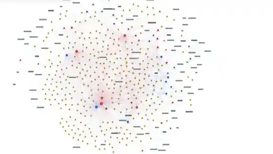
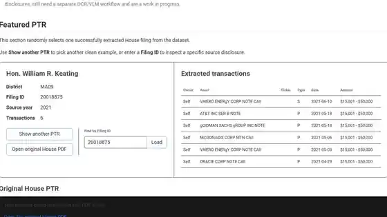
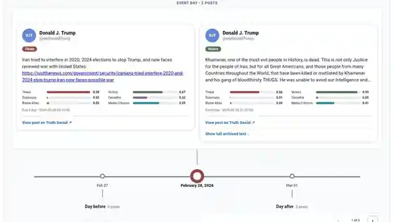

I use data, public records, computational methods, and visualization to investigate politics, technology, and public institutions.

## Projects

:::: {.featured-projects}

::: {.project-card .featured-project-card}
::: {.project-card-art .project-card-image}
{fig-alt="Interactive congressional stock trading network showing politicians, companies, and committees"}
:::
::: {.project-card-body}
::: {.project-card-heading}
### Congressional Stock Trading Network
::: {.project-date}
Fall 2026
:::
:::
::: {.project-tags}
[Network Analysis]{.project-tag} [Public Records]{.project-tag} [Congressional Data]{.project-tag}
:::
Interactive network of reported 2025 House stock purchases, shared companies, committees, and subcommittees with transaction-date-aware committee matching.

[View project →](projects/congressional-stock-network.qmd){.project-link}
:::
:::

::: {.project-card .featured-project-card}
::: {.project-card-art .project-card-image}
{fig-alt="Featured congressional periodic transaction report with extracted stock transactions"}
:::
::: {.project-card-body}
::: {.project-card-heading}
### Politician Stock Disclosures
::: {.project-date}
2024–present
:::
:::
::: {.project-tags}
[Public Records]{.project-tag} [Data Cleaning]{.project-tag} [Civic Technology]{.project-tag}
:::
Turning difficult-to-use financial disclosures into structured data that can be searched, analyzed, and investigated.

[View project →](projects/stock-disclosures.qmd){.project-link}
:::
:::

::: {.project-card .featured-project-card}
::: {.project-card-art .project-card-image}
{fig-alt="Political text analysis timeline connecting Truth Social posts with conflict events"}
:::
::: {.project-card-body}
::: {.project-card-heading}
### Political Text Analysis
::: {.project-date}
Fall 2026
:::
:::
::: {.project-tags}
[NLP]{.project-tag} [Political Data]{.project-tag} [Event Analysis]{.project-tag}
:::
Using computational text analysis to examine political rhetoric around real-world events.

[View project →](projects/iran-timeline.qmd){.project-link}
:::
:::

::: {.project-card .featured-project-card}
::: {.project-card-art .project-card-image .poster-image}
{fig-alt="TankieTube University of Amsterdam Digital Methods research poster"}
:::
::: {.project-card-body}
::: {.project-card-heading}
### TankieTube
::: {.project-date}
Summer 2026
:::
:::
::: {.project-tags}
[Digital Methods]{.project-tag} [Text Analysis]{.project-tag} [Internet Research]{.project-tag}
:::
Five-day University of Amsterdam research sprint comparing a Tankie transcript corpus with Tenet Media/Rumble using TF-IDF and sentence-similarity matching.

[View project →](projects/tankietube.qmd){.project-link}
:::
:::

::::

### More projects

:::: {.more-projects-grid}

::: {.project-card .compact-project-card}
::: {.project-card-body}
::: {.project-card-heading}
### All We Are Solar Map
::: {.project-date}
Spring 2026
:::
:::
::: {.project-tags}
[GIS]{.project-tag} [Nonprofit Data]{.project-tag} [Interactive Visualization]{.project-tag}
:::
Interactive Mapbox visualization turning All We Are's solar installation records into an explorable map of project sites in Uganda.

[View project →](projects/all-we-are-solar-map.qmd){.project-link}
:::
:::

::: {.project-card .compact-project-card}
::: {.project-card-body}
::: {.project-card-heading}
### Lyon Cycling Map
::: {.project-date}
Summer 2025
:::
:::
::: {.project-tags}
[GIS]{.project-tag} [GPS Data]{.project-tag} [Interactive Mapping]{.project-tag}
:::
Cycling routes in Lyon reconstructed from GPS coordinates extracted from GoPro footage and turned into an interactive map.

[View project →](projects/lyon-cycling-map.qmd){.project-link}
:::
:::

::: {.project-card .compact-project-card}
::: {.project-card-body}
::: {.project-card-heading}
### ClearHouse.live
::: {.project-date}
Winter 2024–25
:::
:::
::: {.project-tags}
[Web Scraping]{.project-tag} [Public Records]{.project-tag} [Civic Technology]{.project-tag}
:::
Collaborative public-facing stock-trading platform built from scraped politician financial disclosures; my introduction to public-records data pipelines.

[View project →](projects/clearhouse.qmd){.project-link}
:::
:::

::::
