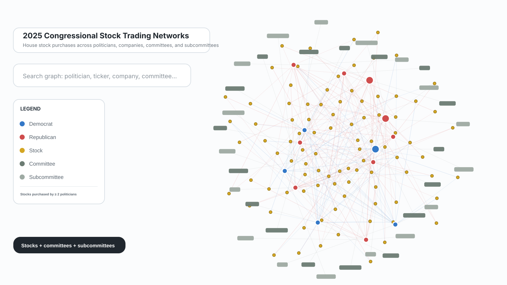
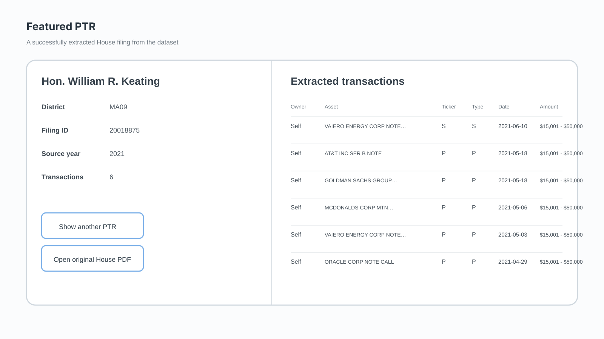
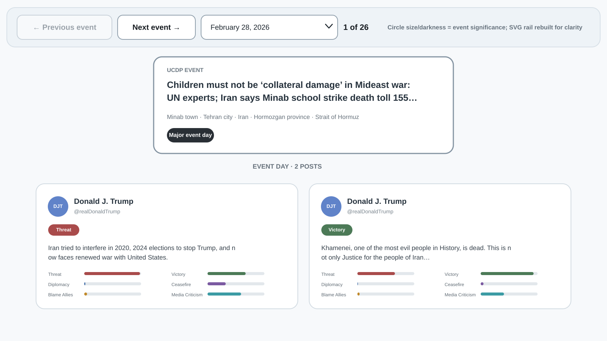

I use data, public records, computational methods, and visualization to investigate politics, technology, and public institutions.

## Projects

:::: {.featured-projects}

::: {.project-card .featured-project-card}
::: {.project-card-art .project-card-live}

<iframe
  src="https://datawrapper.dwcdn.net/28Wwl/18/"
  title="Preview of the Spin geofencing and crash map from Park it here?"
  loading="lazy"
  tabindex="-1"
  aria-hidden="true"
  style="position:absolute;left:0;top:-390px;width:100%;height:calc(100% + 650px);border:0;pointer-events:none;">
</iframe>

:::
::: {.project-card-body}
::: {.project-card-heading}
### [Park it here? E-bike and scooter rules differ across NC State](projects/park-it-here.qmd){.project-title-link}
::: {.project-date}
Sept. 2026
:::
:::
::: {.project-tags}
[Data Journalism]{.project-tag} [GIS]{.project-tag} [Reporting]{.project-tag}
:::
My first published newsroom byline, combining interviews, geofencing data, NCDOT crash records, GIS and Datawrapper maps for Technician.

[View project →](projects/park-it-here.qmd){.project-link}
:::
:::

::: {.project-card .featured-project-card}
::: {.project-card-art .project-card-image}
{fig-alt="Miniature recreation of the congressional stock trading network interface"}

:::
::: {.project-card-body}
::: {.project-card-heading}
### [Congressional Stock Trading Network](projects/congressional-stock-network.qmd){.project-title-link}
::: {.project-date}
Fall 2026
:::
:::
::: {.project-tags}
[Network Analysis]{.project-tag} [Public Records]{.project-tag} [Congressional Data]{.project-tag}
:::
Interactive network of reported 2025 House stock purchases, shared companies, committees, and subcommittees with transaction-date-aware committee matching.

[View project →](projects/congressional-stock-network.qmd){.project-link}
:::
:::

::: {.project-card .featured-project-card}
::: {.project-card-art .project-card-image .stock-image}
{fig-alt="Clean miniature of the Politician Stock Disclosures PTR extraction interface"}

:::
::: {.project-card-body}
::: {.project-card-heading}
### [Politician Stock Disclosures](projects/stock-disclosures.qmd){.project-title-link}
::: {.project-date}
2024–present
:::
:::
::: {.project-tags}
[Public Records]{.project-tag} [Data Cleaning]{.project-tag} [Civic Technology]{.project-tag}
:::
Turning difficult-to-use financial disclosures into structured data that can be searched, analyzed, and investigated.

[View project →](projects/stock-disclosures.qmd){.project-link}
:::
:::

::: {.project-card .featured-project-card}
::: {.project-card-art .project-card-image}
{fig-alt="Miniature recreation of the Iran event and Truth Social post timeline"}

:::
::: {.project-card-body}
::: {.project-card-heading}
### [Political Text Analysis](projects/iran-timeline.qmd){.project-title-link}
::: {.project-date}
Fall 2026
:::
:::
::: {.project-tags}
[NLP]{.project-tag} [Political Data]{.project-tag} [Event Analysis]{.project-tag}
:::
Using computational text analysis to examine political rhetoric around real-world events.

[View project →](projects/iran-timeline.qmd){.project-link}
:::
:::

::: {.project-card .featured-project-card}
::: {.project-card-art .project-card-image .poster-image}
{fig-alt="Actual TankieTube University of Amsterdam Digital Methods project poster artwork"}

:::
::: {.project-card-body}
::: {.project-card-heading}
### [TankieTube](projects/tankietube.qmd){.project-title-link}
::: {.project-date}
Summer 2026
:::
:::
::: {.project-tags}
[Digital Methods]{.project-tag} [Text Analysis]{.project-tag} [Internet Research]{.project-tag}
:::
Five-day University of Amsterdam research sprint comparing a Tankie transcript corpus with Tenet Media/Rumble using TF-IDF and sentence-similarity matching.

[View project →](projects/tankietube.qmd){.project-link}
:::
:::

::::

### More projects

:::: {.more-projects-grid}

::: {.project-card .compact-project-card}
::: {.project-card-art .project-card-live .all-we-are-live}
<iframe
  src="https://strokeofluck.github.io/all-we-are-map-box/?preview=1"
  title="Live preview of the actual All We Are solar installation map"
  loading="lazy"
  tabindex="-1"
  aria-hidden="true">
</iframe>

:::
::: {.project-card-body}
::: {.project-card-heading}
### [All We Are Solar Map](projects/all-we-are-solar-map.qmd){.project-title-link}
::: {.project-date}
Spring 2026
:::
:::
::: {.project-tags}
[GIS]{.project-tag} [Nonprofit Data]{.project-tag} [Interactive Visualization]{.project-tag}
:::
Interactive Mapbox visualization turning All We Are's solar installation records into an explorable map of project sites in Uganda.

[View project →](projects/all-we-are-solar-map.qmd){.project-link}
:::
:::

::: {.project-card .compact-project-card}
::: {.project-card-art .project-card-live .lyon-live}
<iframe
  src="https://www.google.com/maps/d/embed?mid=1gCtK4R45c9pSZ0o5NANokD2_X8GQ5M8&ll=45.7605%2C4.8420&z=11"
  title="Live preview of the actual Lyon cycling route map"
  loading="lazy"
  tabindex="-1"
  aria-hidden="true">
</iframe>

:::
::: {.project-card-body}
::: {.project-card-heading}
### [Lyon Cycling Map](projects/lyon-cycling-map.qmd){.project-title-link}
::: {.project-date}
Summer 2025
:::
:::
::: {.project-tags}
[GIS]{.project-tag} [GPS Data]{.project-tag} [Interactive Mapping]{.project-tag}
:::
Cycling routes in Lyon reconstructed from GPS coordinates extracted from GoPro footage and turned into an interactive map.

[View project →](projects/lyon-cycling-map.qmd){.project-link}
:::
:::

::: {.project-card .compact-project-card}
::: {.project-card-art .project-card-image .clearhouse-image}
{fig-alt="ClearHouse public stock disclosure and trades interface"}

:::
::: {.project-card-body}
::: {.project-card-heading}
### [ClearHouse.live](projects/clearhouse.qmd){.project-title-link}
::: {.project-date}
Winter 2024–25
:::
:::
::: {.project-tags}
[Web Scraping]{.project-tag} [Public Records]{.project-tag} [Civic Technology]{.project-tag}
:::
Collaborative public-facing stock-trading platform built from scraped politician financial disclosures; my introduction to public-records data pipelines.

[View project →](projects/clearhouse.qmd){.project-link}
:::
:::

::::
