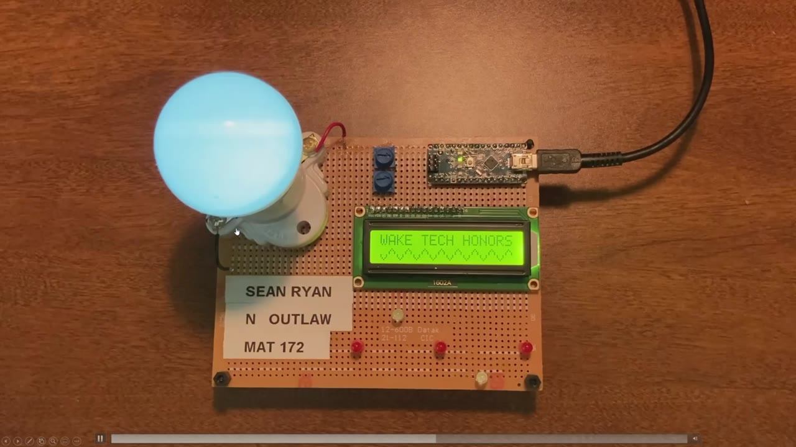

I use data, public records, computational methods, and visualization to investigate politics, technology, and public institutions.

## Projects

:::: {.featured-projects}

::: {.project-card .featured-project-card}
::: {.project-card-art .project-card-image .park-it-here-image}
{fig-alt="Spin geofencing and NCDOT crash map from Park it here?"}
<a href="projects/park-it-here.html" aria-label="Open Park it here? published reporting project" style="position:absolute;inset:0;z-index:3;display:block;"></a>
:::
::: {.project-card-body}
::: {.project-card-heading}
### [Park it here? E-bike and scooter rules differ across NC State](projects/park-it-here.qmd){.project-title-link}
::: {.project-date}
Sept. 2026
:::
:::
::: {.project-tags}
[Data Journalism]{.project-tag} [GIS]{.project-tag} [Reporting]{.project-tag}
:::
Published reporting combining interviews, geofencing data, NCDOT crash records, GIS and Datawrapper maps for Technician.

[View project →](projects/park-it-here.qmd){.project-link}
:::
:::

::: {.project-card .featured-project-card}
::: {.project-card-art .project-card-image}
{fig-alt="Miniature recreation of the congressional stock trading network interface"}
<a href="projects/congressional-stock-network.html" aria-label="Open Congressional Stock Trading Network project" style="position:absolute;inset:0;z-index:3;display:block;"></a>
:::
::: {.project-card-body}
::: {.project-card-heading}
### [Congressional Stock Trading Network](projects/congressional-stock-network.qmd){.project-title-link}
::: {.project-date}
Fall 2026
:::
:::
::: {.project-tags}
[Network Analysis]{.project-tag} [Public Records]{.project-tag} [Congressional Data]{.project-tag}
:::
Interactive network of reported 2025 House stock purchases, shared companies, committees, and subcommittees with transaction-date-aware committee matching.

[View project →](projects/congressional-stock-network.qmd){.project-link}
:::
:::

::: {.project-card .featured-project-card}
::: {.project-card-art .project-card-image .stock-image}
{fig-alt="Clean miniature of the Politician Stock Disclosures PTR extraction interface"}
<a href="projects/stock-disclosures.html" aria-label="Open Politician Stock Disclosures project" style="position:absolute;inset:0;z-index:3;display:block;"></a>
:::
::: {.project-card-body}
::: {.project-card-heading}
### [Politician Stock Disclosures](projects/stock-disclosures.qmd){.project-title-link}
::: {.project-date}
2024–present
:::
:::
::: {.project-tags}
[Public Records]{.project-tag} [Data Cleaning]{.project-tag} [Civic Technology]{.project-tag}
:::
Turning difficult-to-use financial disclosures into structured data that can be searched, analyzed, and investigated.

[View project →](projects/stock-disclosures.qmd){.project-link}
:::
:::

::: {.project-card .featured-project-card}
::: {.project-card-art .project-card-image}
{fig-alt="Miniature recreation of the Iran event and Truth Social post timeline"}
<a href="projects/iran-timeline.html" aria-label="Open Political Text Analysis project" style="position:absolute;inset:0;z-index:3;display:block;"></a>
:::
::: {.project-card-body}
::: {.project-card-heading}
### [Political Text Analysis](projects/iran-timeline.qmd){.project-title-link}
::: {.project-date}
Fall 2026
:::
:::
::: {.project-tags}
[NLP]{.project-tag} [Political Data]{.project-tag} [Event Analysis]{.project-tag}
:::
Using computational text analysis to examine political rhetoric around real-world events.

[View project →](projects/iran-timeline.qmd){.project-link}
:::
:::

::: {.project-card .featured-project-card}
::: {.project-card-art .project-card-image .poster-image}
{fig-alt="Actual TankieTube University of Amsterdam Digital Methods project poster artwork"}
<a href="projects/tankietube.html" aria-label="Open TankieTube project" style="position:absolute;inset:0;z-index:3;display:block;"></a>
:::
::: {.project-card-body}
::: {.project-card-heading}
### [TankieTube](projects/tankietube.qmd){.project-title-link}
::: {.project-date}
Summer 2026
:::
:::
::: {.project-tags}
[Digital Methods]{.project-tag} [Text Analysis]{.project-tag} [Internet Research]{.project-tag}
:::
Five-day University of Amsterdam research sprint comparing a Tankie transcript corpus with Tenet Media/Rumble using TF-IDF and sentence-similarity matching.

[View project →](projects/tankietube.qmd){.project-link}
:::
:::

::::

### More projects

:::: {.more-projects-grid}

::: {.project-card .compact-project-card}
::: {.project-card-art .project-card-live .all-we-are-live}
<iframe
  src="https://strokeofluck.github.io/all-we-are-map-box/?preview=1"
  title="Live preview of the actual All We Are solar installation map"
  loading="lazy"
  tabindex="-1"
  aria-hidden="true">
</iframe>
<a href="projects/all-we-are-solar-map.html" aria-label="Open All We Are Solar Map project" style="position:absolute;inset:0;z-index:3;display:block;"></a>
:::
::: {.project-card-body}
::: {.project-card-heading}
### [All We Are Solar Map](projects/all-we-are-solar-map.qmd){.project-title-link}
::: {.project-date}
Spring 2026
:::
:::
::: {.project-tags}
[GIS]{.project-tag} [Nonprofit Data]{.project-tag} [Interactive Visualization]{.project-tag}
:::
Interactive Mapbox visualization turning All We Are's solar installation records into an explorable map of project sites in Uganda.

[View project →](projects/all-we-are-solar-map.qmd){.project-link}
:::
:::

::: {.project-card .compact-project-card}
::: {.project-card-art .project-card-live .lyon-live}
<iframe
  src="https://www.google.com/maps/d/embed?mid=1gCtK4R45c9pSZ0o5NANokD2_X8GQ5M8&ll=45.7605%2C4.8420&z=11"
  title="Live preview of the actual Lyon cycling route map"
  loading="lazy"
  tabindex="-1"
  aria-hidden="true">
</iframe>
<a href="projects/lyon-cycling-map.html" aria-label="Open Lyon Cycling Map project" style="position:absolute;inset:0;z-index:3;display:block;"></a>
:::
::: {.project-card-body}
::: {.project-card-heading}
### [Lyon Cycling Map](projects/lyon-cycling-map.qmd){.project-title-link}
::: {.project-date}
Summer 2025
:::
:::
::: {.project-tags}
[GIS]{.project-tag} [GPS Data]{.project-tag} [Interactive Mapping]{.project-tag}
:::
Cycling routes in Lyon reconstructed from GPS coordinates extracted from GoPro footage and turned into an interactive map.

[View project →](projects/lyon-cycling-map.qmd){.project-link}
:::
:::

::: {.project-card .compact-project-card}
::: {.project-card-art .project-card-image .schism-image}
```{=html}
<svg class="schism-thumbnail" xmlns="http://www.w3.org/2000/svg" width="1152" height="576" viewBox="0 0 1152 576" preserveAspectRatio="xMidYMid slice" role="img" aria-labelledby="schism-thumb-title schism-thumb-desc">
<title id="schism-thumb-title">Schism</title><desc id="schism-thumb-desc">A red heart above Kiki and Bouba in a stepped gray center between white and black worlds, framed by whole checkerboard squares.</desc>
<defs><pattern id="schism-thumb-checks" width="64" height="64" patternUnits="userSpaceOnUse"><rect width="64" height="64" fill="#101214"/><path d="M0 0h32v32H0zM32 32h32v32H32z" fill="#fff"/></pattern></defs>
<rect width="1152" height="576" fill="#101214"/>
<path d="M128 0H576V544H128Z" fill="#fff"/>
<path d="M384 0L384 32L416 32L416 64L384 64L384 96L416 96L416 128L384 128L384 160L416 160L416 192L384 192L384 224L416 224L416 256L384 256L384 288L416 288L416 320L384 320L384 352L416 352L416 384L384 384L384 416L416 416L416 448L384 448L384 480L416 480L416 512L384 512L384 544L736 544L736 512L768 512L768 480L736 480L736 448L768 448L768 416L736 416L736 384L768 384L768 352L736 352L736 320L768 320L768 288L736 288L736 256L768 256L768 224L736 224L736 192L768 192L768 160L736 160L736 128L768 128L768 96L736 96L736 64L768 64L768 32L736 32L736 0Z" fill="#4b4b4b"/>
<rect width="128" height="576" fill="url(#schism-thumb-checks)"/><rect x="1024" width="128" height="576" fill="url(#schism-thumb-checks)"/>
<path d="M576 374C553 342 454 275 454 209C454 146 531 128 576 186C621 128 698 146 698 209C698 275 599 342 576 374Z" fill="#bd281f"/>
<g transform="translate(0 46)"><g class="schism-kiki"><svg x="490" y="421" width="82" height="82" viewBox="512 0 512 512"><path fill="#101214" d="M 1020.381,233.27638 890.77547,316.41874 885.61405,483.80078 772.67868,395.78812 648.33328,482.85978 635.38602,324.9815 514.53802,261.2902 635.62046,189.82793 621.35644,43.328654 764.74554,124.3455 881.331,29.140447 881.50571,191.91015 Z"/></svg></g></g>
<g transform="translate(0 46)"><g class="schism-bouba"><svg x="578" y="421" width="82" height="82" viewBox="0 0 512 512"><path fill="#ffffff" d="m 401.15004,264.13557 c 3.29372,29.87908 79.35165,91.67001 40.19428,140.28749 -51.73625,64.23529 -117.52888,-43.05517 -138.30083,-32.6781 -34.7879,17.37903 -3.35726,114.90443 -59.22126,108.46317 -97.92491,-11.291 -56.84475,-93.17859 -67.87049,-108.3674 -28.67667,-39.50434 -116.271385,82.47516 -138.240898,-36.57634 -7.815684,-42.35273 99.002698,-82.57517 76.519718,-105.9997 -4.26851,-4.44727 -58.587972,-48.49695 -61.154509,-89.45764 -2.341876,-37.3752 28.1089,-68.048204 70.352219,-39.961143 29.80964,19.820063 42.48337,41.270353 81.56214,21.527883 29.11149,-14.70704 3.00024,-94.209646 46.89409,-99.885941 81.19149,-10.499576 68.51929,100.927031 92.49575,112.691491 27.0725,13.28358 118.35441,-28.36309 130.75839,35.25471 18.62016,95.49945 -81.33559,28.05311 -73.9886,94.70152 z"/></svg></g></g>
<path d="M128 546H1024M128 554H1024M128 562H1024M128 570H1024" stroke="#fff" stroke-width="3"/>
</svg>
```
<a href="projects/game-design-sandbox.html" aria-label="Open Game Design project" style="position:absolute;inset:0;z-index:3;display:block;"></a>
:::
::: {.project-card-body}
::: {.project-card-heading}
### [Game Design](projects/game-design-sandbox.qmd){.project-title-link}
::: {.project-date}
2025
:::
:::
::: {.project-tags}
[Godot]{.project-tag} [Unity]{.project-tag} [Game Design]{.project-tag}
:::
A cooperative puzzle platformer built for an NC State game design class.

[View project →](projects/game-design-sandbox.qmd){.project-link}
:::
:::

::: {.project-card .compact-project-card}
::: {.project-card-art .project-card-image .clearhouse-image}
```{=html}
<div class="ch-thumbnail" role="img" aria-label="ClearHouse Live thumbnail. Representatives 2,762, assets 4,038, disclosures 2,678, transactions 22,963. ">
    <div class="ch-wordmark">Clear<span class="ch-house">House</span><span class="ch-live">Live</span></div>
    <div class="ch-metrics">
      <div class="ch-metric"><span class="ch-icon ch-blue"><svg xmlns="http://www.w3.org/2000/svg" viewBox="0 0 24 24" fill="none" stroke="currentColor" stroke-linecap="round" stroke-linejoin="round" aria-hidden="true"><path d="M16 21v-2a4 4 0 0 0-4-4H6a4 4 0 0 0-4 4v2M16 3.128a4 4 0 0 1 0 7.744M22 21v-2a4 4 0 0 0-3-3.87"/><circle cx="9" cy="7" r="4"/></svg></span><span class="ch-number">2,762</span><span class="ch-label"><span class="ch-label-full">Representatives</span><span class="ch-label-short">Reps</span></span></div>
      <div class="ch-metric"><span class="ch-icon ch-pink"><svg xmlns="http://www.w3.org/2000/svg" viewBox="0 0 24 24" fill="none" stroke="currentColor" stroke-linecap="round" stroke-linejoin="round" aria-hidden="true"><path d="M12 12h.01M16 6V4a2 2 0 0 0-2-2h-4a2 2 0 0 0-2 2v2M22 13a18.15 18.15 0 0 1-20 0"/><rect width="20" height="14" x="2" y="6" rx="2"/></svg></span><span class="ch-number">4,038</span><span class="ch-label">Assets</span></div>
      <div class="ch-metric"><span class="ch-icon ch-purple"><svg xmlns="http://www.w3.org/2000/svg" viewBox="0 0 24 24" fill="none" stroke="currentColor" stroke-linecap="round" stroke-linejoin="round" aria-hidden="true"><path d="M6 22a2 2 0 0 1-2-2V4a2 2 0 0 1 2-2h8a2.4 2.4 0 0 1 1.704.706l3.588 3.588A2.4 2.4 0 0 1 20 8v12a2 2 0 0 1-2 2zM14 2v5a1 1 0 0 0 1 1h5M10 9H8M16 13H8M16 17H8"/></svg></span><span class="ch-number">2,678</span><span class="ch-label"><span class="ch-label-full">Disclosures</span><span class="ch-label-short">Filings</span></span></div>
      <div class="ch-metric"><span class="ch-icon ch-green"><svg xmlns="http://www.w3.org/2000/svg" viewBox="0 0 24 24" fill="none" stroke="currentColor" stroke-linecap="round" stroke-linejoin="round" aria-hidden="true"><path d="m16 3 4 4-4 4M20 7H4m4 14-4-4 4-4M4 17h16"/></svg></span><span class="ch-number">22,963</span><span class="ch-label"><span class="ch-label-full">Transactions</span><span class="ch-label-short">Trades</span></span></div>
    </div>
  </div>
<script src="projects/assets/cards/clearhouse-thumbnail.js?v=card-preview-4" defer></script>
```
<a href="projects/clearhouse.html" aria-label="Open ClearHouse.live project" style="position:absolute;inset:0;z-index:3;display:block;"></a>
:::
::: {.project-card-body}
::: {.project-card-heading}
### [ClearHouse.live](projects/clearhouse.qmd){.project-title-link}
::: {.project-date}
Winter 2024–25
:::
:::
::: {.project-tags}
[Web Scraping]{.project-tag} [Public Records]{.project-tag} [Civic Technology]{.project-tag}
:::
Collaborative public-facing stock-trading platform built from scraped politician financial disclosures; my introduction to public-records data pipelines.

[View project →](projects/clearhouse.qmd){.project-link}
:::
:::

::: {.project-card .compact-project-card}
::: {.project-card-art .project-card-image}
```{=html}
<canvas class="design-tv-thumbnail" width="180" height="145" data-frames="projects/assets/visual-design-fabrication/tv-frames.png" role="img" aria-label="Pixel-art television, facing forward when still and rotating on hover" style="display:block;width:100%;height:100%;object-fit:contain;image-rendering:pixelated;background:#202c50;"></canvas>
<script src="projects/assets/visual-design-fabrication/thumbnail.js?v=still-cleanup-1" defer></script>
```
<a href="projects/visual-design-fabrication.html" aria-label="Open Visual Design and Digital Fabrication project" style="position:absolute;inset:0;z-index:3;display:block;"></a>
:::
::: {.project-card-body}
::: {.project-card-heading}
### [Visual Design & Digital Fabrication](projects/visual-design-fabrication.qmd){.project-title-link}
::: {.project-date}
Spring 2023
:::
:::
::: {.project-tags}
[Visual Design]{.project-tag} [Photoshop]{.project-tag} [Digital Fabrication]{.project-tag}
:::
Topographic models, laser-cut objects, vector graphics, and photo editing from my desktop publishing and imaging work.

[View project →](projects/visual-design-fabrication.qmd){.project-link}
:::
:::

::: {.project-card .compact-project-card .technical-guides-card}
::: {.project-card-art .project-card-image .technical-guides-image}
```{=html}
<div class="technical-guide-covers">


</div>
```
<a href="projects/technical-communication-design.html" aria-label="Open Technical Communication and Prototyping project" style="position:absolute;inset:0;z-index:3;display:block;"></a>
:::
::: {.project-card-body}
::: {.project-card-heading}
### [Technical Communication & Prototyping](projects/technical-communication-design.qmd){.project-title-link}
::: {.project-date}
2021–2023 · Selected earlier work
:::
:::
::: {.project-tags}
[Technical Communication]{.project-tag} [Visual Instruction]{.project-tag} [Design]{.project-tag}
:::
Illustrated equipment guides, a team manufacturing report, and hands-on design projects from my fabrication and engineering education work.

[View project →](projects/technical-communication-design.qmd){.project-link}
:::
:::

::: {.project-card .compact-project-card}
::: {.project-card-art .project-card-image}
{fig-alt="Glowing lamp, LEDs, and LCD on my Arduino sine-wave prototype"}
<a href="projects/arduino-mathematical-visualization.html" aria-label="Open Arduino and Mathematical Visualization project" style="position:absolute;inset:0;z-index:3;display:block;"></a>
:::
::: {.project-card-body}
::: {.project-card-heading}
### [Arduino & Mathematical Visualization](projects/arduino-mathematical-visualization.qmd){.project-title-link}
::: {.project-date}
2021–2022 · Selected earlier work
:::
:::
::: {.project-tags}
[Arduino]{.project-tag} [Programming]{.project-tag} [Electronics]{.project-tag}
:::
Three Wake Tech honors builds using light, a rotary encoder, and ultrasonic sensors to give mathematical ideas a physical, interactive form.

[View project →](projects/arduino-mathematical-visualization.qmd){.project-link}
:::
:::

::: {.project-card .compact-project-card}
::: {.project-card-art .project-card-image}
```{=html}
<div class="t8085-art" data-8085-thumbnail aria-hidden="true"><div class="t8085-window"><div class="t8085-bar"><span>CELSIUS TO FAHRENHEIT.ASM</span><span>INTEL 8085 · 2020</span></div><div class="t8085-panes"><div class="t8085-code" aria-hidden="true"></div><div class="t8085-temperature" aria-hidden="true"><span class="t8085-small">25°C INPUT</span><span class="t8085-reading">77°F</span><div class="t8085-thermo"><div class="t8085-mercury"></div></div><span class="t8085-phase">Complete</span></div></div></div></div>
<script src="projects/assets/cards/8085-thumbnail.js" defer></script>
```
<a href="projects/8085-assembly.html" aria-label="Open Intel 8085 Assembly Project" style="position:absolute;inset:0;z-index:3;display:block;"></a>
:::
::: {.project-card-body}
::: {.project-card-heading}
### [Intel 8085 Assembly Project](projects/8085-assembly.qmd){.project-title-link}
::: {.project-date}
Fall 2020
:::
:::
::: {.project-tags}
[Assembly]{.project-tag} [Computer Architecture]{.project-tag} [Technical Foundations]{.project-tag}
:::
I wrote this final project in assembly for a microprocessor class focused on the Intel 8085 in 2020. At the time, I was learning assembly and being introduced to programming, before AI coding assistants became part of everyday development. I later built this browser-based 8085 simulator to revisit my original code and thought process from 2020.

[View project →](projects/8085-assembly.qmd){.project-link}
:::
:::


::::
