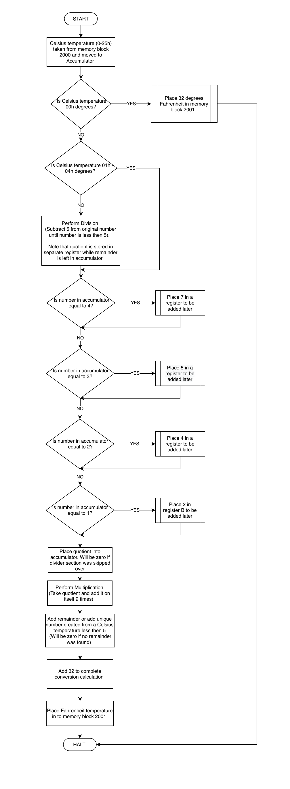

::: {.assembly-project-shell}

<p class="assembly-lede">While earning my associate degree in Electronics Engineering Technology at Wake Technical Community College, I wrote an Intel 8085 assembly program that converts Celsius inputs into two-digit BCD Fahrenheit. I came back to it because it captures my introduction to programming: working directly with registers, memory addresses, flags and jumps before generative-AI coding assistants became part of everyday programming.</p>

<div class="assembly-tags" aria-label="Project topics">
  <span class="assembly-tag">Assembly</span>
  <span class="assembly-tag">Intel 8085</span>
  <span class="assembly-tag">BCD arithmetic</span>
  <span class="assembly-tag">Technical foundations</span>
</div>

```{=html}
<section class="assembly-intro-grid">
  <div>
    <h2>The assignment</h2>
    <p>Read a Celsius value from memory address <code>2000h</code>, convert any input from 0–37°C into Fahrenheit, store the two-digit binary-coded decimal result at <code>2001h</code>, and document the program with a flowchart and comments.</p>
    <p>The code below preserves the instruction sequence and logic I submitted in 2020, including the commented testing harness and the explanations I wrote while learning the material.</p>
  </div>
  <div class="assembly-artifacts" aria-label="Project files">
    <a href="assets/8085-assembly/project-to-standard.asm" download>Download the assembly source</a>
    <a href="assets/8085-assembly/flowchart.pdf" target="_blank" rel="noopener">Open the original flowchart ↗</a>
    <a href="https://8085simulator.github.io/" target="_blank" rel="noopener">Open Jubin Mitra’s 8085 Simulator ↗</a>
  </div>
</section>
```

<section class="assembly-simulator-heading">
  <h2>Step through the program</h2>
  <p>This browser recreation follows the same source while exposing the registers, flags and memory locations involved in the calculation. It implements the instructions used by this project rather than trying to replace a complete 8085 emulator.</p>
</section>

```{=html}
<div class="assembly-simulator" data-assembly-simulator data-source="assets/8085-assembly/project-to-standard.asm">
  <div class="assembly-toolbar">
    <div class="assembly-control-group">
      <label>Celsius input, 0–37
        <input data-assembly-input type="number" min="0" max="37" value="25" inputmode="numeric">
      </label>
      <button data-assembly-load class="assembly-primary" type="button">Load into 2000h</button>
    </div>
    <div class="assembly-button-group">
      <button data-assembly-step type="button">Step</button>
      <button data-assembly-run type="button">Run</button>
      <button data-assembly-reset type="button">Restart</button>
    </div>
  </div>

  <div class="assembly-sim-grid">
    <div class="assembly-code-panel">
      <div class="assembly-code-bar">
        <span>PROJECT TO STANDARD.ASM</span>
        <button data-assembly-source-toggle type="button" aria-pressed="false">Show all source</button>
      </div>
      <div class="assembly-code-view" data-assembly-code aria-label="Assembly source code"></div>
    </div>

    <aside class="assembly-state-panel" aria-label="8085 processor state">
      <div class="assembly-state-title">
        <strong>Processor state</strong>
        <span class="assembly-step-count" data-assembly-step-count>0 steps</span>
      </div>
      <div class="assembly-registers" data-assembly-registers></div>

      <div class="assembly-state-block">
        <div class="assembly-state-label">Flags</div>
        <div class="assembly-flag-row">
          <div class="assembly-flag"><span>Z</span><b data-assembly-zero>0</b></div>
          <div class="assembly-flag"><span>CY</span><b data-assembly-carry>0</b></div>
        </div>
      </div>

      <div class="assembly-state-block">
        <div class="assembly-state-label">Memory</div>
        <div class="assembly-memory-row">
          <div class="assembly-memory"><span>2000h</span><b data-assembly-memory-input>19h</b></div>
          <div class="assembly-memory"><span>2001h</span><b data-assembly-memory-output>--</b></div>
        </div>
      </div>

      <div class="assembly-result-box" aria-live="polite">
        <span>Decoded result</span>
        <strong data-assembly-result>Loading source…</strong>
      </div>
    </aside>
  </div>

  <div class="assembly-execution-note" aria-live="polite">
    <strong data-assembly-phase>Loading</strong>
    <span data-assembly-detail>Loading the original assembly source.</span>
  </div>
</div>
```

```{=html}
<section class="assembly-method-grid" aria-label="How the program works">
  <div>
    <h3>1. Divide by five</h3>
    <p>The program repeatedly subtracts five, using register C to count the quotient and the accumulator to retain the remainder.</p>
  </div>
  <div>
    <h3>2. Multiply by nine</h3>
    <p>It repeatedly adds the quotient and uses <code>DAA</code> to keep the intermediate value in binary-coded decimal.</p>
  </div>
  <div>
    <h3>3. Store the result</h3>
    <p>After adding the rounded remainder contribution and 32, it writes the BCD Fahrenheit value to memory address <code>2001h</code>.</p>
  </div>
</section>
```

## The original flowchart

```{=html}
<figure class="assembly-flowchart">
  
  <figcaption>The flowchart submitted with the program in October 2020.</figcaption>
</figure>
```

```{=html}
<section class="assembly-reflection-grid">
  <div>
    <h2>Why I came back to it</h2>
    <p>This is not how I would solve a temperature conversion today, which is exactly why the project is worth preserving. The limited instruction set made every operation visible. Division became a loop of subtractions. Multiplication became repeated addition. Decimal output required understanding what the processor stored and how a person would read it.</p>
    <p>Looking back, I can see the beginning of an approach I still use in data work: break a larger problem into inspectable steps, keep the source visible, and make the transformation understandable to someone following along.</p>
  </div>
  <div class="assembly-note">
    <h2>A note on the course text</h2>
    <p>John Clevenger’s <em>ELN 232: Introduction to Microprocessors</em> set an early standard for me. It took subjects such as number systems, registers, instruction timing and assembly language and made them visual and digestible.</p>
    <p>I appreciate the care he put into making difficult technical material approachable. That example still influences how I try to explain code, data and methodology now.</p>
  </div>
</section>
```

```{=html}
<script src="assets/8085-assembly/8085-project.js"></script>
```

:::
