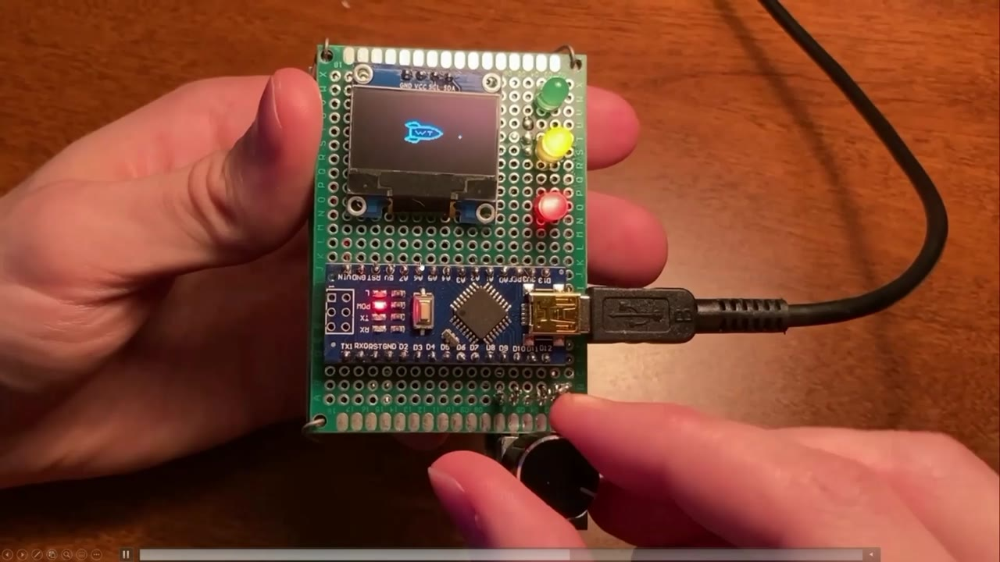
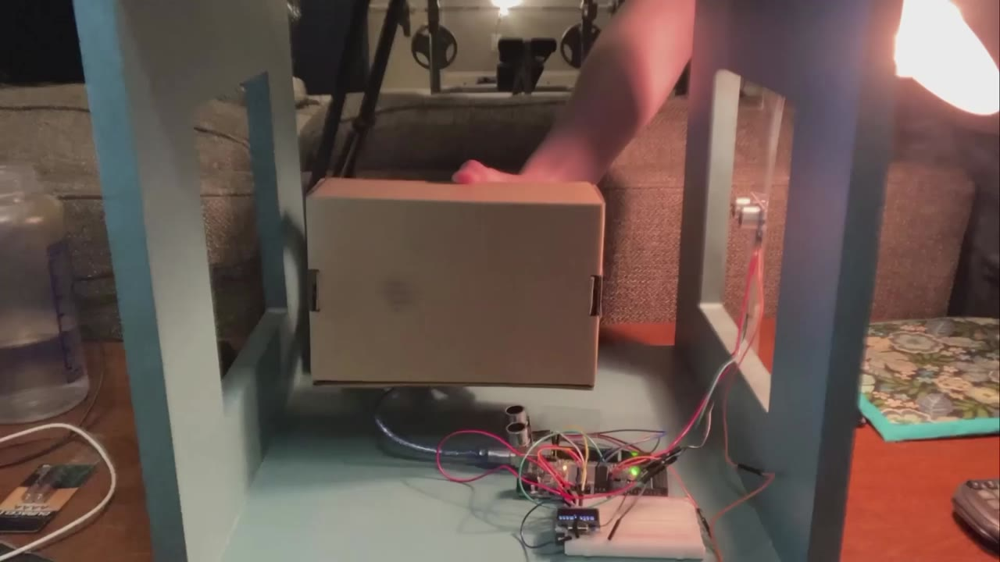

```{=html}
<div class="honors-project">

<header class="intro"><h1>Arduino &amp; Mathematical Visualization</h1><p class="subtitle">Electronics · Programming · Hands-on learning</p><p class="lede">Three honors projects I built at Wake Technical Community College to make abstract mathematical ideas tangible through light, motion, and interactive hardware.</p><p class="meta">2021–2022 · Selected earlier work</p></header>
<div class="overview" aria-label="The three builds">
<a href="#sine-wave"><span>Sine-wave display <span aria-hidden="true">↗</span></span></a>
<a href="#encoder"><span>Rotary encoder <span aria-hidden="true">↗</span></span></a>
<a href="#ultrasonic"><span>Position tracking <span aria-hidden="true">↗</span></span></a>
</div>
<aside class="archive" id="about-recordings"><strong>Original student recordings</strong><p>Original honors project recordings from 2021–2022, showing the hardware, programming, and demonstrations.</p></aside>

<section id="sine-wave" class="project"><div class="section-title"><div><h2>Visualizing a sine wave</h2><p>Precalculus Trigonometry · Spring 2021</p></div><span class="duration">Original video · 6:14</span></div>
<div class="project-grid"><div class="media"><iframe class="youtube-player" id="sine-video" title="Sine-wave display video" src="https://www.youtube.com/embed/6av0uusRBfA?enablejsapi=1&amp;playsinline=1&amp;rel=0&amp;mute=1" allow="autoplay; encrypted-media; picture-in-picture; fullscreen" referrerpolicy="strict-origin-when-cross-origin" allowfullscreen></iframe><div class="video-links"><a class="demo-link" href="https://www.youtube.com/watch?v=6av0uusRBfA&amp;t=117s" target="_blank" rel="noopener" data-video="sine-video" data-time="117">▶ Jump to demo · 1:57</a><a href="https://www.youtube.com/watch?v=6av0uusRBfA" target="_blank" rel="noopener">Watch on YouTube ↗</a></div></div><div class="description"><p>For my precalculus honors project, I wanted to give the sine wave a hands-on, visual reference. I built a prototype board with an Arduino—a small computer—an LCD screen, five LEDs, and a larger lightbulb.</p><p>First, look at the LCD screen: the display steps through the midpoint, positive peak, midpoint, and negative peak before repeating. The LEDs below it mark those stages, while the larger bulb grows brighter and fades back down.</p><p>I also show the switching signal on an oscilloscope and explain how pulse-width modulation controls the bulb’s fade.</p></div></div>
</section>

<section id="encoder" class="project"><div class="section-title"><div><h2>Making rate of change visible</h2><p>Calculus I · Fall 2021</p></div><span class="duration">Original video · 6:30</span></div>
<div class="project-grid"><div class="media"><iframe class="youtube-player" id="encoder-video" title="Rotary encoder video" src="https://www.youtube.com/embed/mX6IBwznPmc?enablejsapi=1&amp;playsinline=1&amp;rel=0&amp;mute=1" allow="autoplay; encrypted-media; picture-in-picture; fullscreen" referrerpolicy="strict-origin-when-cross-origin" allowfullscreen></iframe><div class="video-links"><a class="demo-link" href="https://www.youtube.com/watch?v=mX6IBwznPmc&amp;t=322s" target="_blank" rel="noopener" data-video="encoder-video" data-time="322">▶ Jump to demo · 5:22</a><a href="https://www.youtube.com/watch?v=mX6IBwznPmc" target="_blank" rel="noopener">Watch on YouTube ↗</a></div></div><div class="description"><p>For my Calculus I honors project, I wanted a practical example of rate of change—something you could turn in your hand and see respond.</p><p>The prototype has a dial, colored LEDs, and a screen with a Wake Tech rocket. As I turn the dial, the program uses changes in the encoder reading over time to adjust the animation and lights.</p><p>I start slowly with the red light, then turn faster to bring in the yellow and green lights. By the end, the lights are all on and the rocket is flying. That was the idea: give an abstract concept a visible response.</p></div></div>
</section>

<section id="ultrasonic" class="project"><div class="section-title"><div><h2>Tracking position with sound</h2><p>Calculus II · Spring 2022</p></div><span class="duration">Original video · 6:23</span></div>
<div class="project-grid"><div class="media"><iframe class="youtube-player" id="ultrasonic-video" title="Position tracking video" src="https://www.youtube.com/embed/OwVAvB1jUCE?enablejsapi=1&amp;playsinline=1&amp;rel=0&amp;mute=1" allow="autoplay; encrypted-media; picture-in-picture; fullscreen" referrerpolicy="strict-origin-when-cross-origin" allowfullscreen></iframe><div class="video-links"><a class="demo-link" href="https://www.youtube.com/watch?v=OwVAvB1jUCE&amp;t=239s" target="_blank" rel="noopener" data-video="ultrasonic-video" data-time="239.5" data-pause="true">▶ Jump to demo · 3:59.5</a><a href="https://www.youtube.com/watch?v=OwVAvB1jUCE" target="_blank" rel="noopener">Watch on YouTube ↗</a></div></div><div class="description"><p>For my Calculus II honors project, I used a wooden frame with an Arduino, two ultrasonic sensors, and a small display. The sensors send out sound pulses that hit an object and bounce back; the return time can be used to estimate distance.</p><p>Watch the little marker on the screen as I move the box between the sensors. First I move it side to side, then up and down, and finally in both directions. The marker follows, and the horizontal and vertical distance readings update alongside it.</p><p>The readings are rough approximations. I wanted something hands-on and easy to play with that connected the math to a working device.</p></div></div>
</section>
<section class="closing"><a href="https://strokeofluck.github.io/sean-data-portfolio/">← Back to all projects</a></section>

</div>
<script src="assets/arduino-mathematical-visualization/players.js"></script>
<script src="https://www.youtube.com/iframe_api"></script>
```
