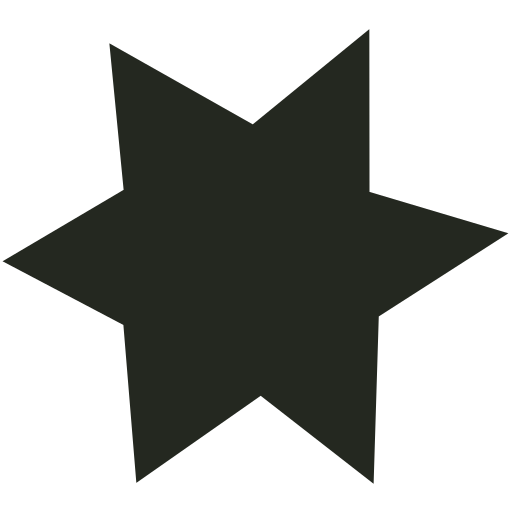
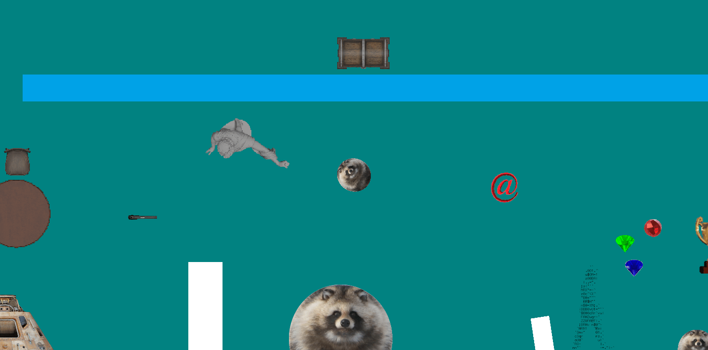
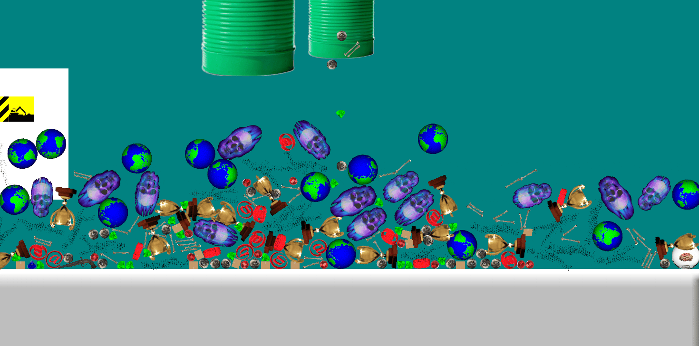
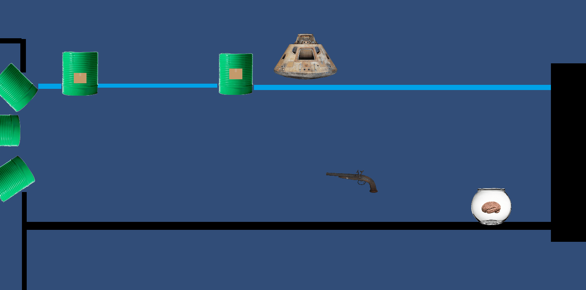

```{=html}
<div class="game-page">


<section id="schism" class="schism-section" aria-labelledby="schism-title">
 <div class="schism-heading"><div><p class="eyebrow">Spring 2025</p><h1 id="schism-title">SCHISM</h1></div><p class="schism-definition"><em>schism</em> · noun<br>A formal division or split between people within an organization or movement.</p></div>
 <div class="project-story"><div><p class="eyebrow">Built together</p><h3>Cooperation is the mechanic.</h3></div><div><p>Two players cross the same level, but collide with opposite colors. A route that works for one can be an obstacle for the other. Swap boxes and chess pieces change the board; progress depends on thinking together.</p></div></div>
 <div class="controls"><div><div><h3>Kiki · Black player</h3><p><kbd>A</kbd> <kbd>D</kbd> Move <kbd>W</kbd> Jump <kbd>S</kbd> Interact</p></div></div><div><div><h3>Bouba · White player</h3><p><kbd>←</kbd> <kbd>→</kbd> Move <kbd>↑</kbd> Jump <kbd>↓</kbd> Interact</p></div></div></div>
 <div class="game-shell" data-game-shell>
  <div class="landscape-mode-bar"><button type="button" data-landscape-mode aria-pressed="false" aria-describedby="landscape-hint">Play side by side ↔</button><p id="landscape-hint" data-landscape-hint role="status">2 players</p></div>
  <div class="player-bar"><span><i class="live-dot"></i> Godot / Two players / Keyboard or touch</span><span>Browser edition</span></div>
  <button class="game-launch" data-game-launch type="button"><span class="launch-card"><span class="play-circle" aria-hidden="true">▶</span><strong>Enter the world</strong><span>Launch Schism · approximately 49 MB</span></span></button>
  <div class="game-stage" data-game-stage hidden><iframe data-game-frame data-src="assets/game-design-sandbox/play/index.html" title="Schism — cooperative puzzle platformer" allow="autoplay; fullscreen; gamepad" allowfullscreen></iframe></div>
  <div class="player-toolbar"><div class="audio-controls"><button type="button" data-mute aria-pressed="false">Mute</button><label for="game-volume">Game volume</label><input id="game-volume" data-volume type="range" min="0" max="100" step="1" value="10"><output for="game-volume" data-volume-value>10%</output><span data-audio-status role="status" class="audio-feedback"></span></div><p class="toolbar-status" data-game-status role="status" aria-live="polite">Loads when you press play.</p><div class="player-actions" hidden><button type="button" data-restart disabled title="Reset this level (R)">Restart level</button><button type="button" data-fullscreen>Fullscreen ↗</button><button type="button" data-close>Close game</button></div></div>

 </div>
 <div class="game-details"><p class="keyboard-note">Keyboard or touch controls.<br>On mobile, use the left pad for Kiki and the right pad for Bouba. Up jumps; down interacts. Restart level (or <kbd>R</kbd>) resets the current puzzle. Choose “Play side by side” for landscape with one player at each end.</p><p class="credit">Sean Ryan + Ben Antinozzi + Kyle Setzer<br>CSC 281: Interactive Game Design · NC State<br>Godot / GDScript</p></div>


</section>

<figure class="intro-film" aria-labelledby="intro-film-caption">
 <div class="film-heading"><p class="eyebrow">Watch / The ending</p></div>
 <video autoplay muted loop controls playsinline preload="metadata" poster="assets/game-design-sandbox/schism-poster.jpg" aria-label="Schism heart ending gameplay video" aria-describedby="intro-film-caption">
  <source src="assets/game-design-sandbox/schism-ending-clean.mp4" type="video/mp4">
  Your browser cannot play this video. <a href="assets/game-design-sandbox/schism-ending-clean.mp4">Watch the Schism heart ending.</a>
 </video>
 <figcaption id="intro-film-caption">The ending of Schism, when the two players finally come together.</figcaption>
</figure>

<section id="unity" class="unity-section" aria-labelledby="unity-title"><div class="section-heading"><div><p class="eyebrow">Summer 2023</p><h2 id="unity-title">First steps in Unity</h2></div><p>Some fun GIFs from exploring a game engine for the first time.</p></div>
<button class="motion-toggle" type="button" data-motion-toggle aria-pressed="false">Pause animations</button>
<div class="experiment-grid">
 <article><button class="image-open" type="button" data-image="unity-car.gif" aria-label="Enlarge vehicle and collision study"></button></article>
 <article><button class="image-open" type="button" data-image="unity-physics.gif" aria-label="Enlarge spawned-object physics study"></button></article>
 <article><button class="image-open" type="button" data-image="unity-conveyor.gif" aria-label="Enlarge physics bones and musket ball experiment"></button></article>
</div></section>
<footer class="lab-footer"><a href="../index.html">Back to the portfolio ↗</a></footer>
<dialog class="image-dialog" aria-label="Experiment image viewer"><button type="button" data-dialog-close aria-label="Close image viewer">Close ×</button><p></p></dialog>
</div>
```
