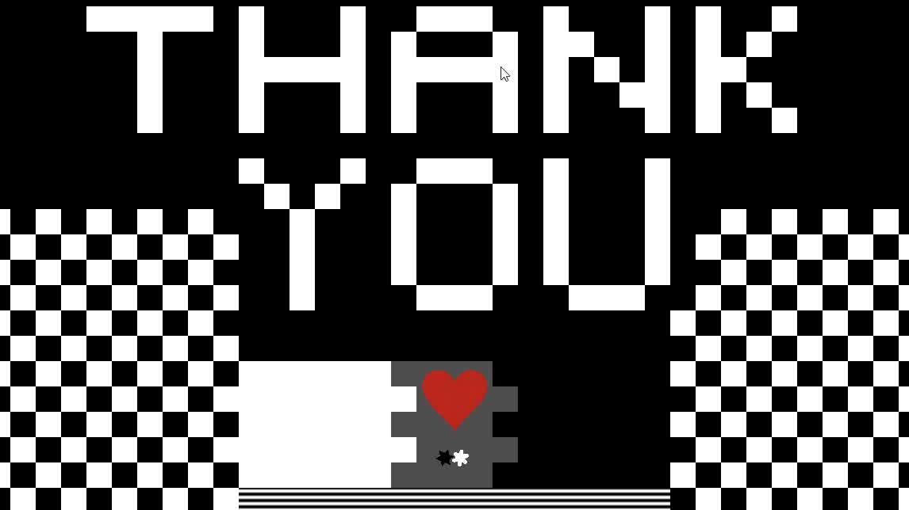
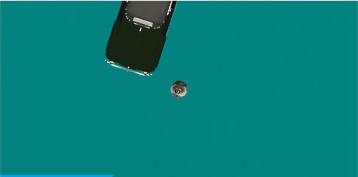
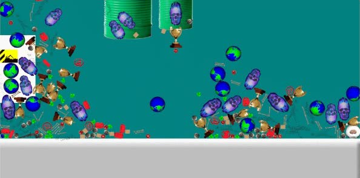
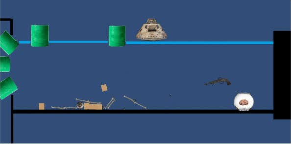

::: {.game-page}

```{=html}
<header class="game-intro">
  <p class="game-eyebrow">Unity experiments · Godot collaboration</p>
  <p class="game-lede">I began experimenting with game engines in summer 2023, using physics as a way to learn through play. <em>Schism</em>, a collaborative puzzle platformer built in Godot with Ben Antinozzi, turned those loose experiments into a shared system with rules, constraints and an ending.</p>
  <div class="game-tags" aria-label="Project tools and topics">
    <span>Unity</span><span>C#</span><span>Godot</span><span>GDScript</span><span>Game design</span>
  </div>
</header>

<section class="schism-section" aria-labelledby="schism-title">
  <div class="schism-copy">
    <p class="section-label">Collaborative project · Spring 2025</p>
    <h2 id="schism-title">Schism</h2>
    <p class="schism-summary">Two players cross the same level but collide with opposite colors. To reach the exits together, they use swap boxes and chess pieces to change which tiles exist for each player.</p>

    <dl class="project-facts">
      <div><dt>Team</dt><dd>Sean Ryan + Ben Antinozzi</dd></div>
      <div><dt>Engine</dt><dd>Godot</dd></div>
      <div><dt>Genre</dt><dd>Cooperative puzzle platformer</dd></div>
      <div><dt>Input</dt><dd>Two players, one keyboard</dd></div>
    </dl>
  </div>

  <div class="schism-media" data-game-shell>
    <button class="game-launch" type="button" data-game-launch aria-label="Launch the playable Schism web build">
      
      <span class="play-mark" aria-hidden="true">▶</span>
      <span class="play-label">Launch playable build · desktop keyboard required</span>
    </button>
    <div class="game-stage" data-game-stage hidden>
      <div class="game-status" data-game-status role="status">Loading the game…</div>
      <iframe data-game-frame data-src="https://strokeofluck.github.io/Schism/" title="Playable Schism game" allow="autoplay; fullscreen; gamepad" allowfullscreen></iframe>
    </div>
  </div>
</section>

<section class="play-notes" aria-label="Schism controls">
  <div>
    <p class="section-label">Controls</p>
    <p><strong>Black player</strong> — <kbd>A</kbd> <kbd>D</kbd> to move, <kbd>W</kbd> to jump, <kbd>S</kbd> to interact</p>
  </div>
  <div>
    <p class="section-label">Second player</p>
    <p><strong>White player</strong> — arrow keys to move and jump; <kbd>↓</kbd> to interact</p>
  </div>
  <p class="game-size-note">The browser build is about 49 MB and does not download until you press Launch.</p>
</section>

<section class="mechanics" aria-labelledby="mechanics-title">
  <div class="mechanics-heading">
    <p class="section-label">The central system</p>
    <h2 id="mechanics-title">One space, two realities</h2>
  </div>
  <div class="mechanic-grid">
    <article>
      <span class="mechanic-number">01</span>
      <h3>Opposite collision</h3>
      <p>The black and white players occupy the same map, but each can stand only on tiles of the opposite color.</p>
    </article>
    <article>
      <span class="mechanic-number">02</span>
      <h3>Chess as level logic</h3>
      <p>Stationary pieces flip tiles along legal chess movements, turning familiar rules into paths through the level.</p>
    </article>
    <article>
      <span class="mechanic-number">03</span>
      <h3>Progress through cooperation</h3>
      <p>Changing the route for one player can remove it for the other, so both players have to plan before moving.</p>
    </article>
  </div>
</section>

<section class="unity-section" aria-labelledby="unity-title">
  <div class="unity-heading">
    <div>
      <p class="section-label">Summer 2023</p>
      <h2 id="unity-title">Unity physics experiments</h2>
    </div>
    <p>Small, messy experiments in rigid bodies, collisions, spawning and moving environments. They are less a finished game than a record of learning what an engine will let you do.</p>
  </div>

  <div class="unity-strip">
    <figure class="unity-frame frame-wide">
      
      <figcaption><span>01</span> Vehicle and collision study</figcaption>
    </figure>
    <figure class="unity-frame frame-tall">
      
      <figcaption><span>02</span> Spawned-object physics test</figcaption>
    </figure>
    <figure class="unity-frame frame-wide">
      
      <figcaption><span>03</span> Moving-environment study</figcaption>
    </figure>
  </div>
</section>

```

:::
