```{=html}
<div class="visual-design-project">
<header class="intro"><a class="crumb" href="https://strokeofluck.github.io/sean-data-portfolio/">← All projects</a><div class="eyebrow">Spring 2023 · NC State</div><h1>Visual Design &amp; Digital Fabrication</h1><p class="lede">From a landscape’s contours to a layered wooden model. Selected work in visual communication, image editing, and digital fabrication.</p><div class="tags"><span>Visual communication</span><span>Illustrator &amp; Photoshop</span><span>Digital fabrication</span></div><div class="jump"><a href="#yates">Yates Mill</a><a href="#carriage">Tiny Treasures</a><a href="#design">Graphic design &amp; imaging</a></div></header>
<div class="originalgallery"><section id="design"><h2>Introduction to Illustrator - Personal Logos</h2><div class="grid three logos"><button class="art" aria-label="Enlarge: Personal logo concept 1">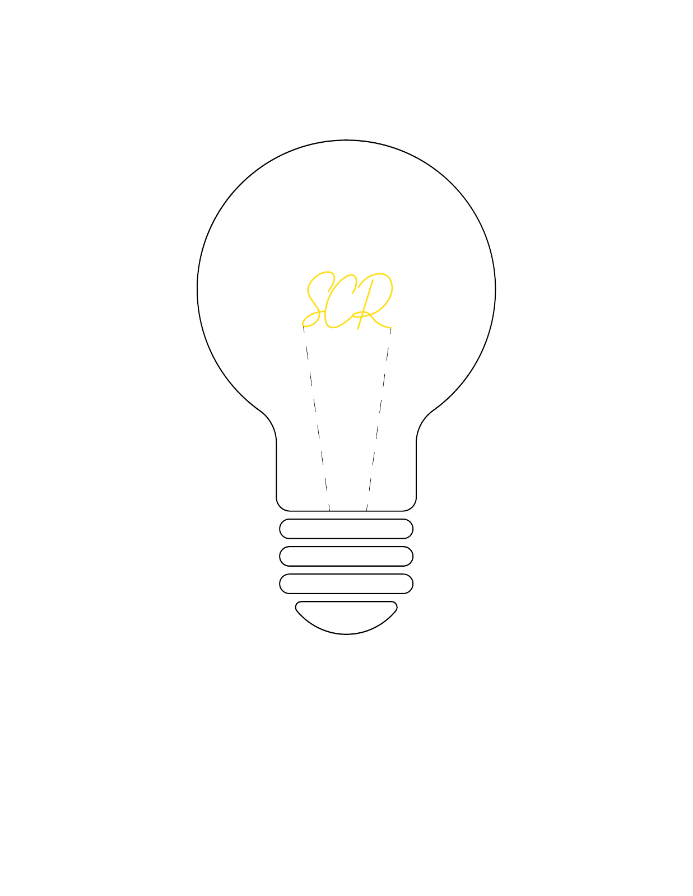</button><button class="art" aria-label="Enlarge: Personal logo concept 2">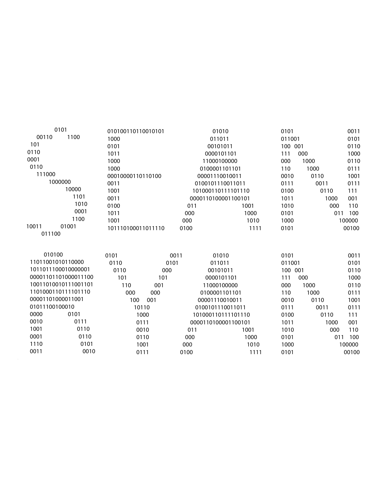</button><button class="art" aria-label="Enlarge: Personal logo concept 3">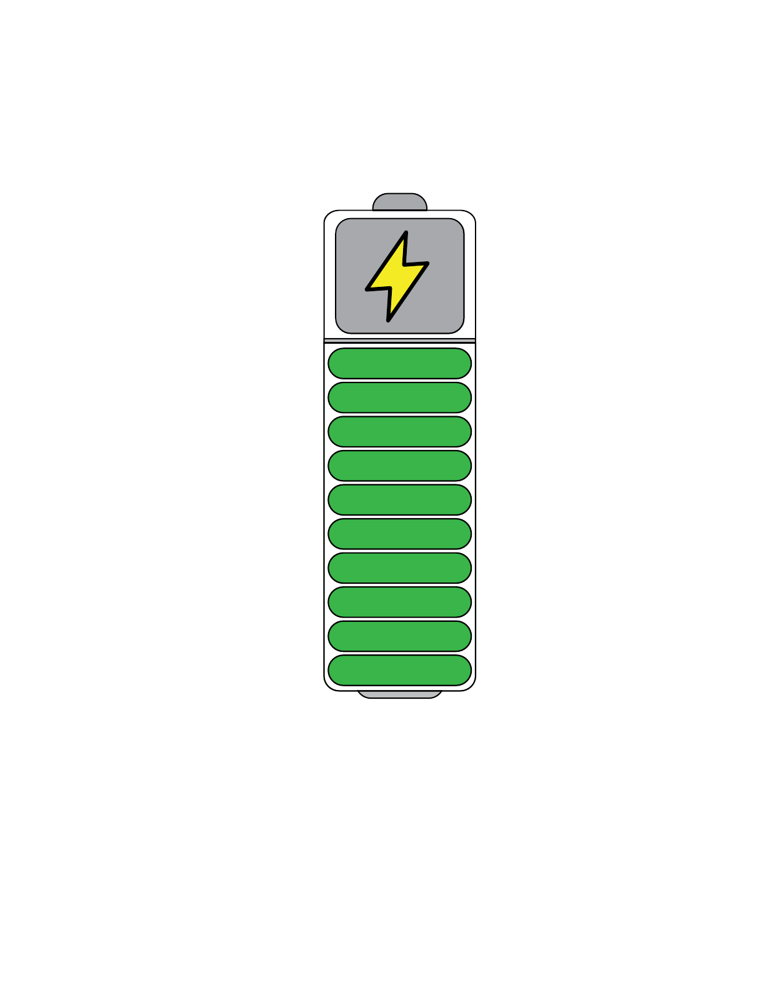</button></div></section><section id="magazine-ad"><h2>Magazine ad</h2><div class="ad-controls"><label for="ad-size">Image size</label><span>Smaller</span><input id="ad-size" type="range" min="20" max="100" value="100" step="1" aria-describedby="ad-size-hint"><span>Larger</span><output id="ad-size-value" for="ad-size">100%</output><button type="button" id="ad-size-reset">Reset</button></div><p id="ad-size-hint" class="size-hint">Having trouble seeing the hidden message? Make the image smaller using the slider, or move farther from your screen.</p><div class="document ad-stage"><button class="art" aria-label="Enlarge: Mister Key Escape Rooms magazine advertisement">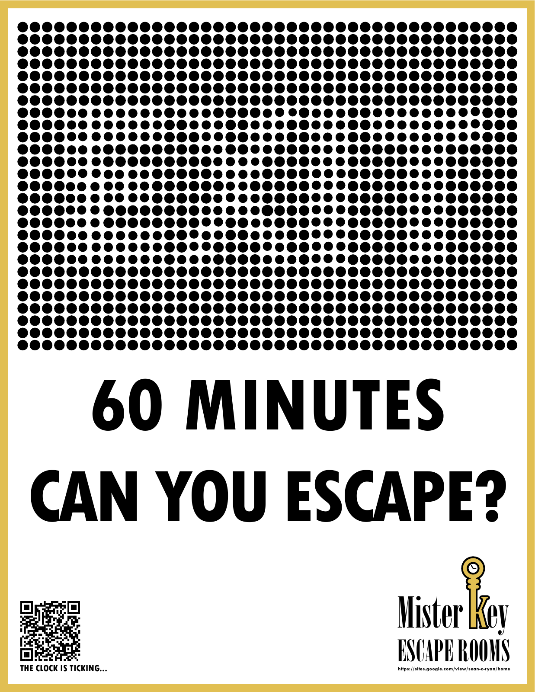</button></div></section><section id="carriage"><h2>Illustrator Final - Tiny Treasures Carriage</h2><div class="grid carriage"><div class="stack"><button class="art" aria-label="Enlarge: Tiny Treasures carriage design — image 1">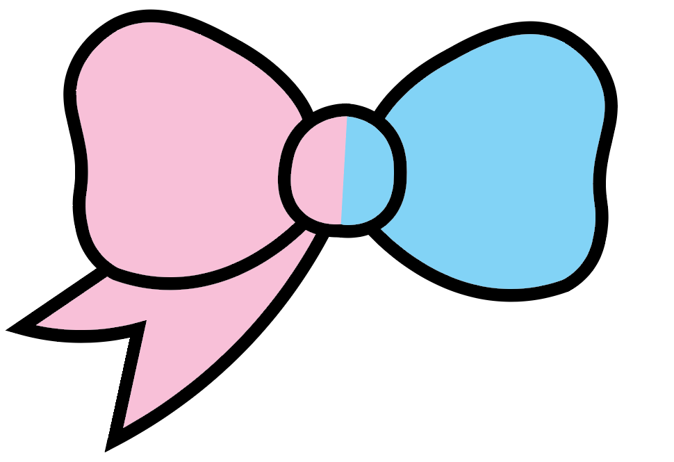</button><button class="art" aria-label="Enlarge: Tiny Treasures carriage design — image 2">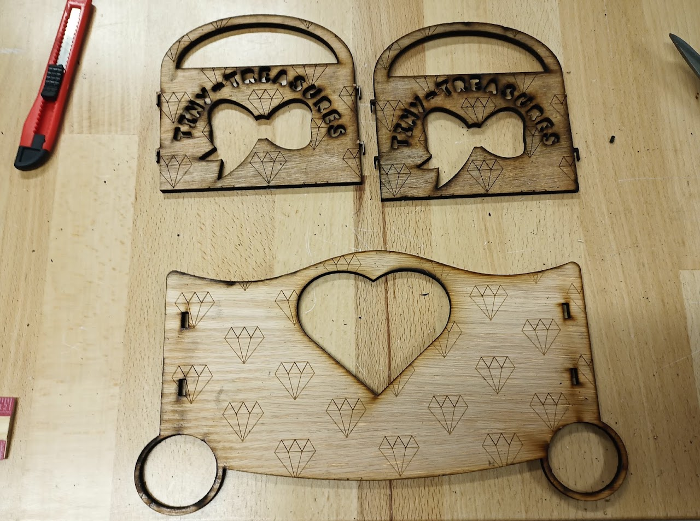</button><button class="art" aria-label="Enlarge: Tiny Treasures carriage design — image 3">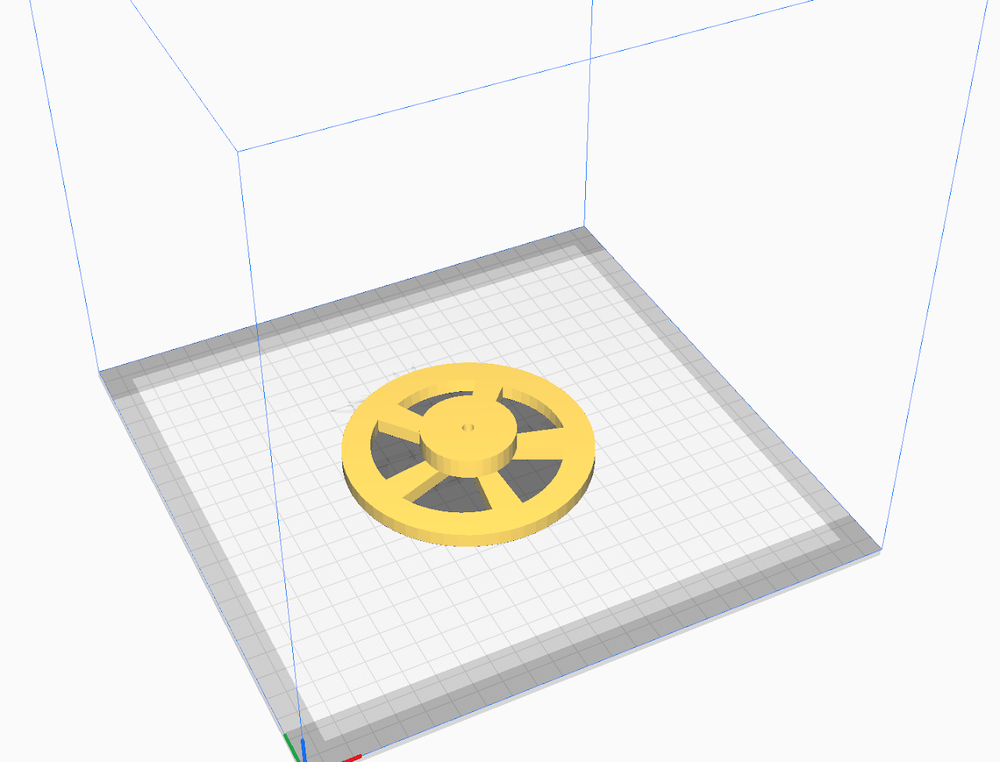</button></div><div class="stack"><button class="art" aria-label="Enlarge: Completed Tiny Treasures carriage — image 1">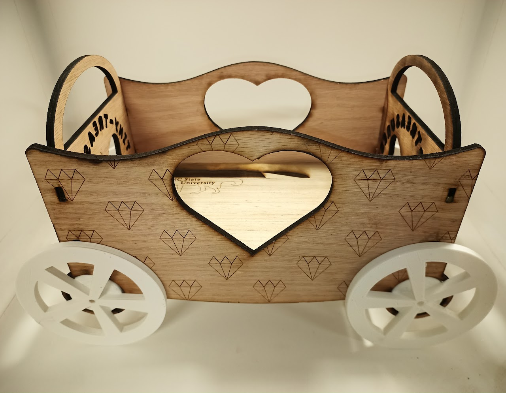</button><button class="art" aria-label="Enlarge: Completed Tiny Treasures carriage — image 2">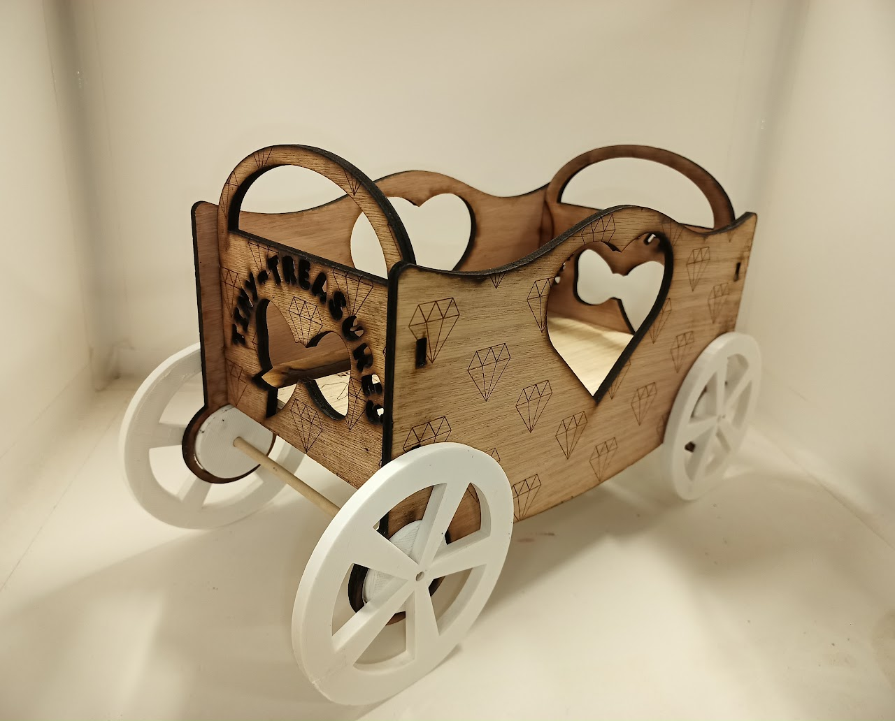</button></div></div></section><section class=""><h2>Koh Samui, Thailand — before &amp; after</h2><p class="gallery-intro">A Photoshop exercise using a photo from my scuba trip in Koh Samui, Thailand.</p><div class="grid scuba"><div><button class="art" aria-label="Enlarge: Koh Samui scuba photo before editing">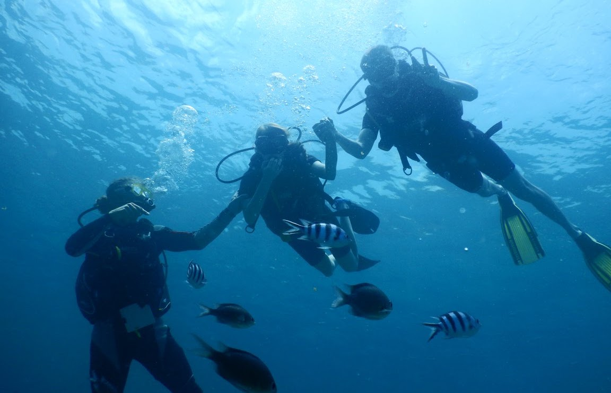</button><h3>Before</h3></div><div><button class="art" aria-label="Enlarge: Koh Samui scuba photo after editing">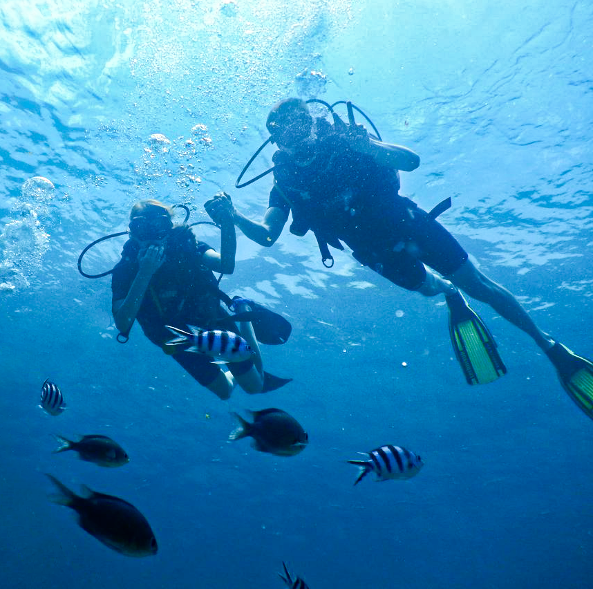</button><h3>After</h3></div></div></section><section class=""><h2>8-Bit Sprite Activity - Photoshop</h2><div class="grid sprite"><div class="stack"><button class="art" aria-label="Enlarge: 8-bit sprite sheet — image 1">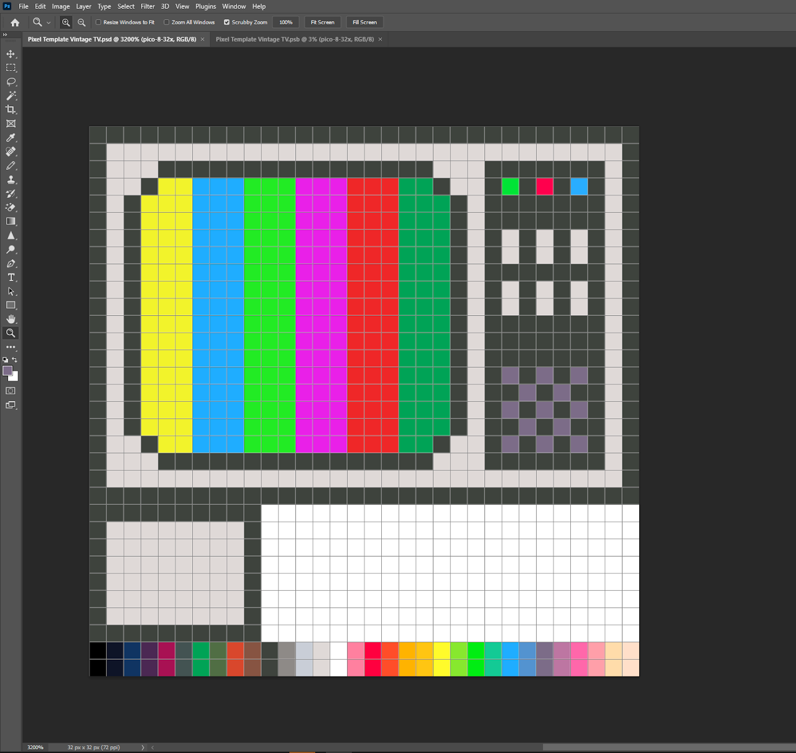</button></div><div class="stack"><button class="art" aria-label="Enlarge: Animated 8-bit sprite — image 1">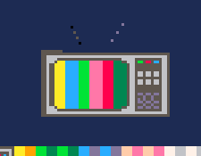</button></div></div></section><section id="photoshop-comparisons"><h2>Photoshop — before &amp; after</h2><div class="grid three photo-pairs"><article><h3>Sky replacement</h3><div class="stack"><figure><figcaption>Before</figcaption><button class="art" aria-label="Enlarge: Sky replacement — before"></button></figure><figure><figcaption>After</figcaption><button class="art" aria-label="Enlarge: Sky replacement — after"></button></figure></div></article><article><h3>Image compositing</h3><div class="stack"><figure><figcaption>Before</figcaption><button class="art" aria-label="Enlarge: Image compositing — before">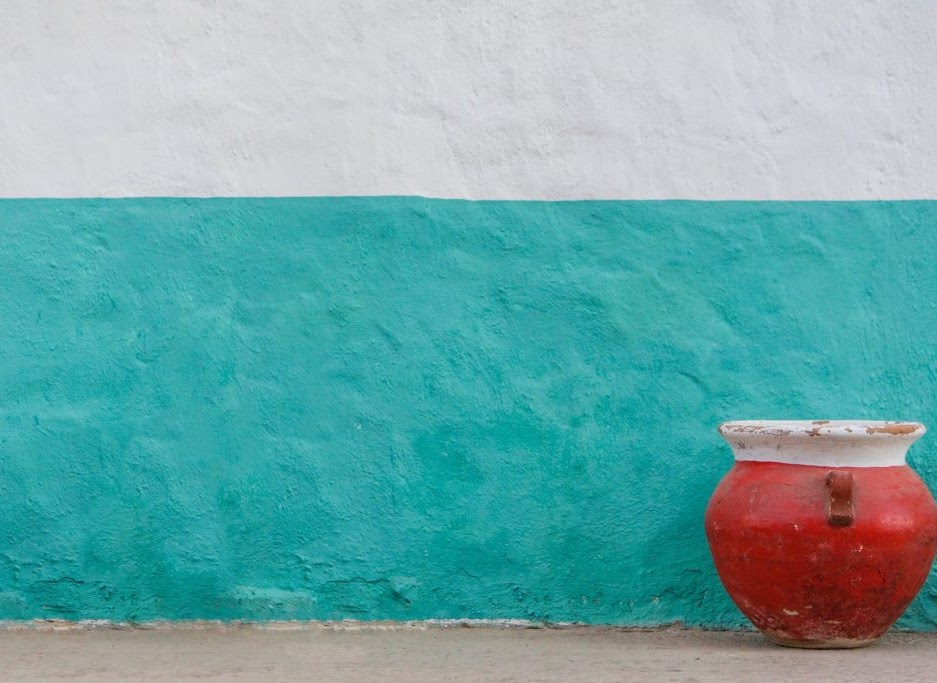</button></figure><figure><figcaption>After</figcaption><button class="art" aria-label="Enlarge: Image compositing — after">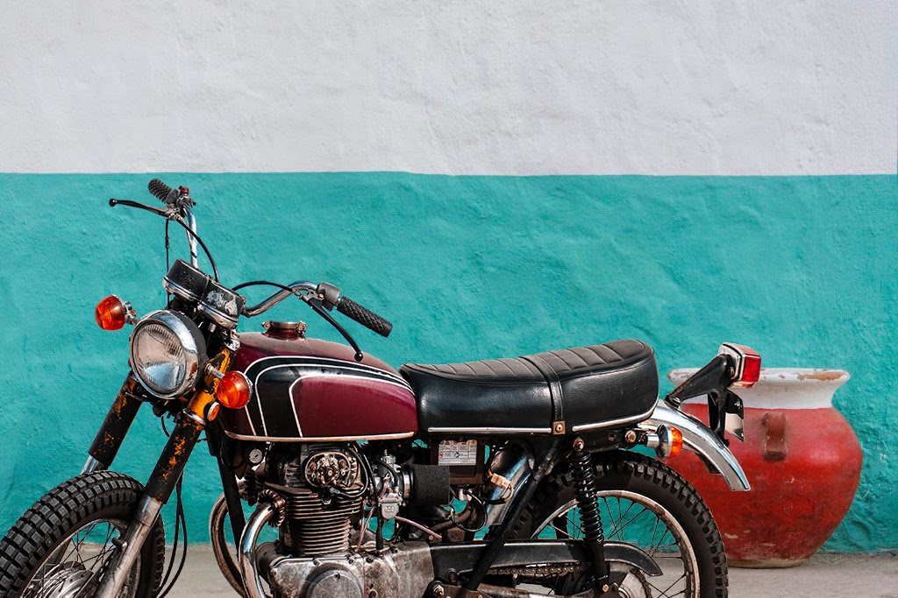</button></figure></div></article><article><h3>Portrait editing</h3><div class="stack"><figure><figcaption>Before</figcaption><button class="art" aria-label="Enlarge: Portrait editing — before"></button></figure><figure><figcaption>After</figcaption><button class="art" aria-label="Enlarge: Portrait editing — after"></button></figure></div></article></div></section><section class=""><h2>Rebrand a Brand - Font Exercise</h2><div class="grid two"><div><button class="art" aria-label="Enlarge: Nintendo with Sega font"></button><h3>Nintendo with Sega Font</h3></div><div><button class="art" aria-label="Enlarge: Sega with Nintendo font"></button><h3>Sega with Nintendo Font</h3></div></div><div class="bonus"><button class="art" aria-label="Enlarge: NCSU logo with Comic Sans font"></button><h3>Bonus NCSU Logo with Comic Sans Font</h3></div></section><section class=""><div class="grid final"><div class="portrait"><button class="art" aria-label="Enlarge: Low poly portrait">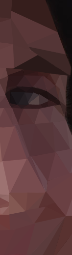</button><h3>Low Poly</h3></div><div><p class="trip-description">A Photoshop composite using a photo from my trip to Da Nang, Vietnam.</p><div class="stack"><button class="art" aria-label="Enlarge: Vietnam - Da Nang trip photo editing — image 1">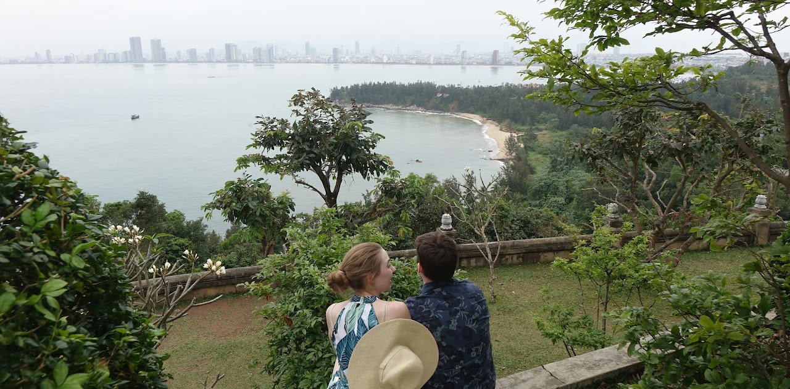</button><button class="art" aria-label="Enlarge: Vietnam - Da Nang trip photo editing — image 2">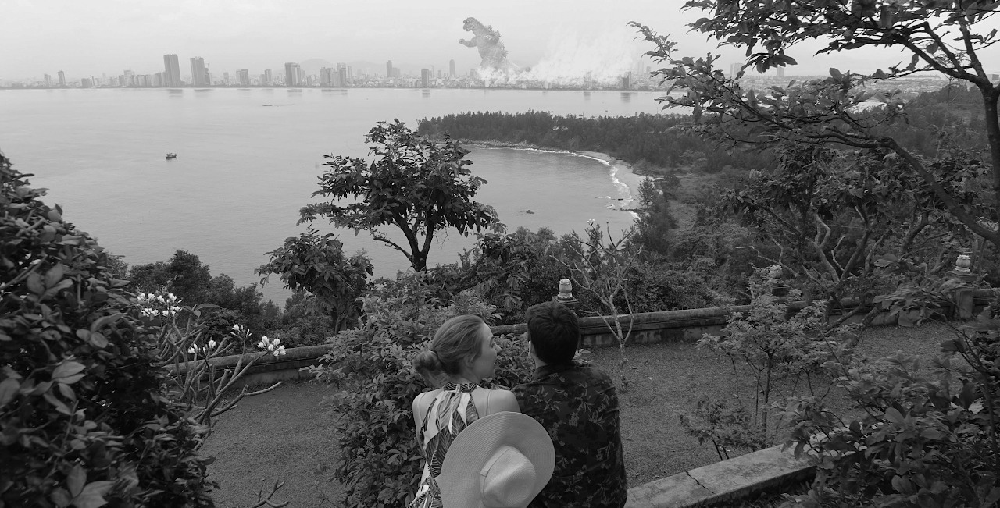</button></div><h3>Vietnam - Da Nang Trip</h3></div></div></section><section id="business-card"><h2>A business card that becomes a rocket</h2><p class="gallery-intro">The flat wooden card holds the pieces for a small rocket. Here are both sides of the card, followed by the assembled model.</p><div class="grid three card-sequence"><figure><button class="art" aria-label="Enlarge: 1. Front of the card">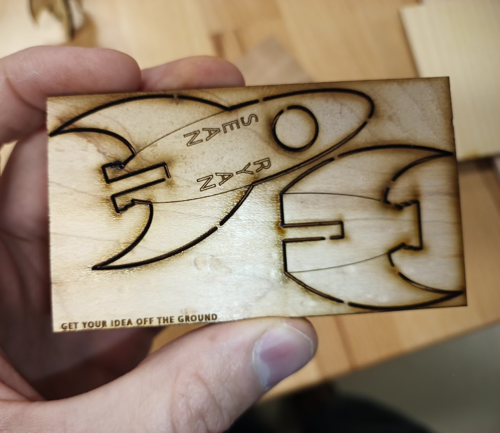</button><figcaption><strong>1. Front of the card</strong><br>My name and the rocket pieces, with “Get your idea off the ground” along the edge.</figcaption></figure><figure><button class="art" aria-label="Enlarge: 2. Back of the card">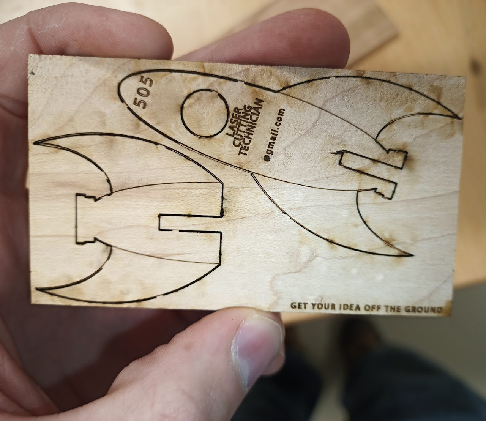</button><figcaption><strong>2. Back of the card</strong><br>The reverse carries the business-card details. The pieces are still held in the flat card.</figcaption></figure><figure><button class="art" aria-label="Enlarge: 3. Assembled rocket">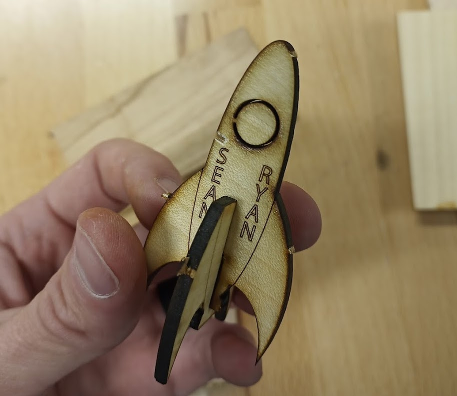</button><figcaption><strong>3. Assembled rocket</strong><br>The pieces come out of the card and slot together into a three-dimensional rocket.</figcaption></figure></div></section><section id="yates"><h2>Millstone sticker designs</h2><div class="grid stone-comparison"><figure><button class="art" aria-label="Enlarge: Millstone reference photograph">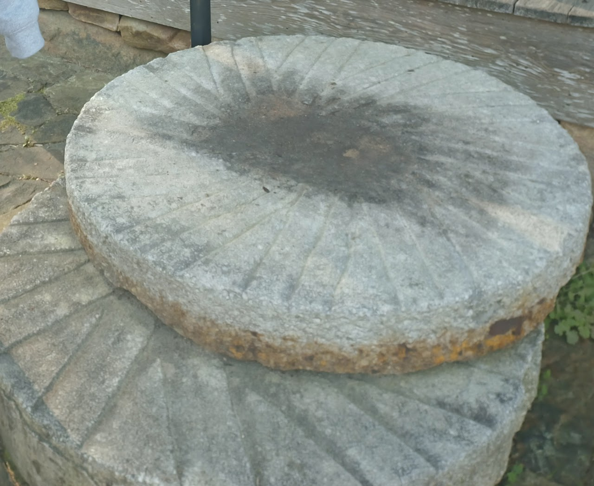</button><figcaption>Millstone reference</figcaption></figure><figure><button class="art sticker-board" aria-label="Enlarge: All ten vector sticker designs">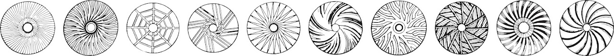<span class="sticker-tiles"><span class="sticker-tile" aria-hidden="true"></span><span class="sticker-tile" aria-hidden="true"></span><span class="sticker-tile" aria-hidden="true"></span><span class="sticker-tile" aria-hidden="true"></span><span class="sticker-tile" aria-hidden="true"></span><span class="sticker-tile" aria-hidden="true"></span><span class="sticker-tile" aria-hidden="true"></span><span class="sticker-tile" aria-hidden="true"></span><span class="sticker-tile" aria-hidden="true"></span><span class="sticker-tile" aria-hidden="true"></span></span></button><figcaption>Vector sticker designs</figcaption></figure></div></section><section id="topographic-map"><h2>Topographic map</h2><p class="gallery-intro">I traced the contours of a topographic map into individual layers, prepared the outlines for laser cutting, then cut and stacked the wooden pieces to create a physical 3D topographic map.</p><div class="grid two"><div class="stack"><button class="art" aria-label="Enlarge: Topographic map reference and design — image 1">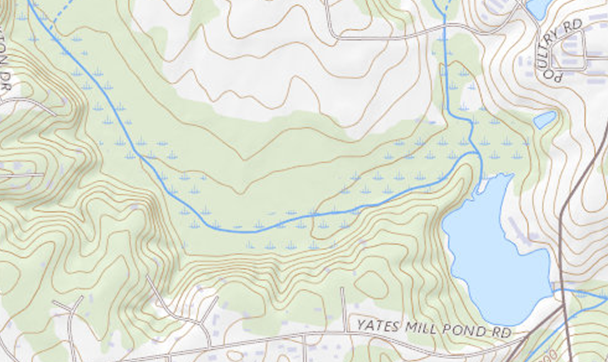</button><button class="art" aria-label="Enlarge: Topographic map reference and design — image 2">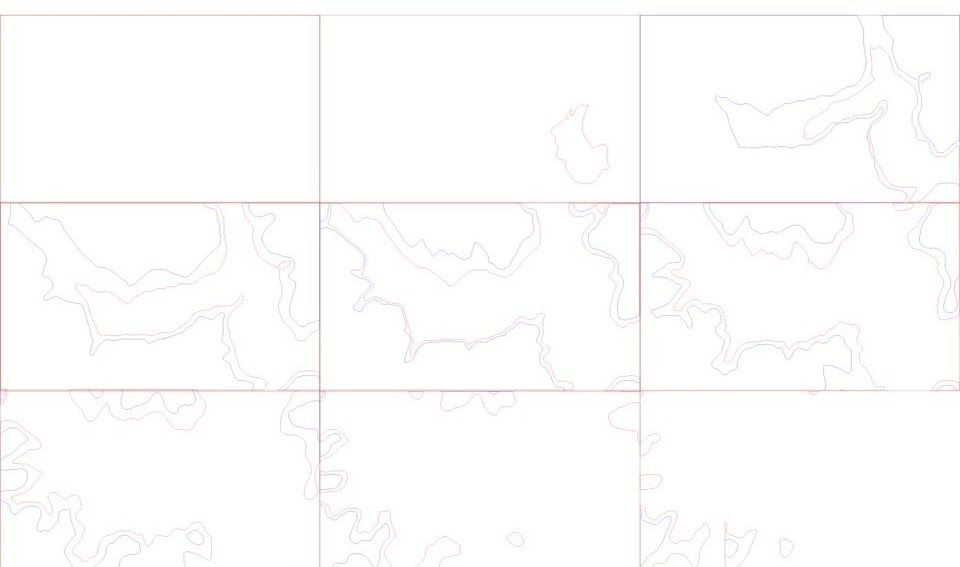</button></div><div class="stack"><button class="art" aria-label="Enlarge: Finished wooden topographic model — image 1">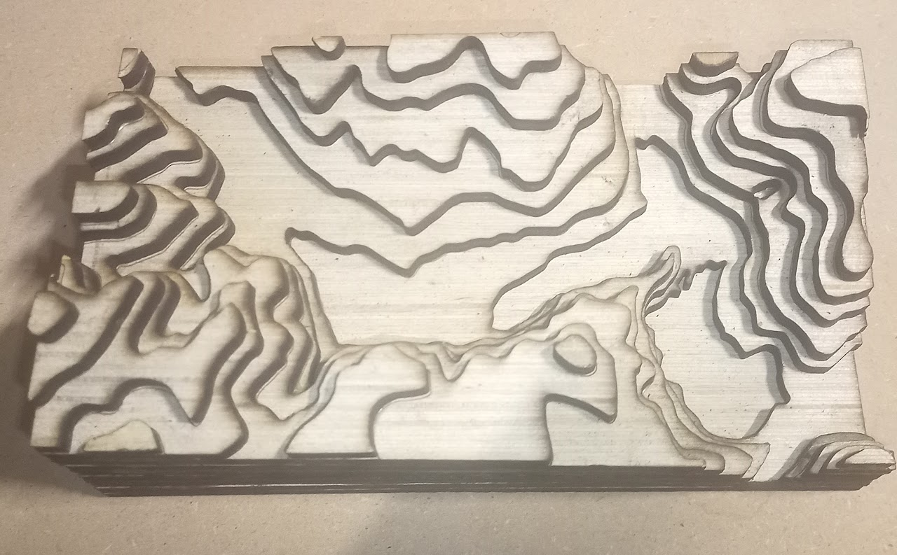</button><button class="art" aria-label="Enlarge: Finished wooden topographic model — image 2">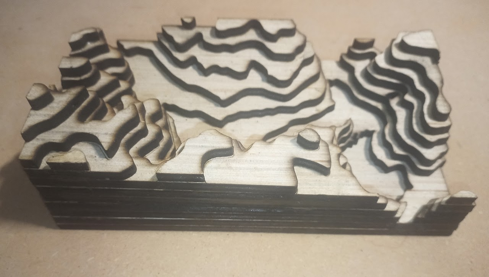</button></div></div></section></div><dialog id="viewer" aria-label="Enlarged artwork"><button aria-label="Close enlarged artwork">Close ×</button><p></p></dialog><script>const viewer=document.getElementById('viewer');document.querySelectorAll('.visual-design-project .art').forEach(b=>b.addEventListener('click',()=>{const im=b.querySelector('img');viewer.querySelector('img').src=im.src;viewer.querySelector('img').alt=im.alt;viewer.querySelector('p').textContent=im.alt;viewer.showModal()}));viewer.querySelector('button').onclick=()=>viewer.close();viewer.addEventListener('click',e=>{if(e.target===viewer)viewer.close()});</script><script>
const adSize=document.getElementById('ad-size');
const adImage=document.querySelector('#magazine-ad .art');
const adValue=document.getElementById('ad-size-value');
function resizeAd(){adImage.style.width=adSize.value+'%';adValue.textContent=adSize.value+'%';adSize.setAttribute('aria-valuetext',adSize.value+' percent');}
adSize.addEventListener('input',resizeAd);
document.getElementById('ad-size-reset').addEventListener('click',()=>{adSize.value='100';resizeAd();});
resizeAd();
</script>
</div>
```
